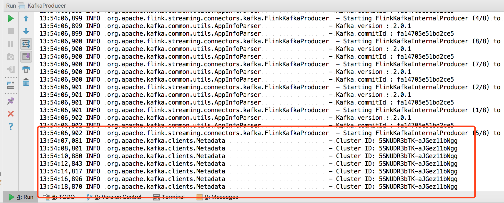
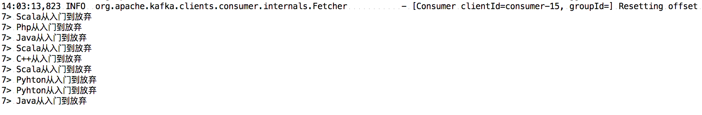

## 简介

Flink-kafka-connector用来做什么？

Kafka中的partition机制和Flink的并行度机制结合，实现数据恢复
Kafka可以作为Flink的source和sink
任务失败，通过设置kafka的offset来恢复应用

### kafka简单介绍


关于kafka，我们会有专题文章介绍，这里简单介绍几个必须知道的概念。

**1.生产者（Producer）**
    顾名思义，生产者就是生产消息的组件，它的主要工作就是源源不断地生产出消息，然后发送给消息队列。生产者可以向消息队列发送各种类型的消息，如狭义的字符串消息，也可以发送二进制消息。生产者是消息队列的数据源，只有通过生产者持续不断地向消息队列发送消息，消息队列才能不断处理消息。
**2.消费者（Consumer）**
    所谓消费者，指的是不断消费（获取）消息的组件，它获取消息的来源就是消息队列（即Kafka本身）。换句话说，生产者不断向消息队列发送消息，而消费者则不断从消息队列中获取消息。
**3.主题（Topic）**
    主题是Kafka中一个极为重要的概念。首先，主题是一个逻辑上的概念，它用于从逻辑上来归类与存储消息本身。多个生产者可以向一个Topic发送消息，同时也可以有多个消费者消费一个Topic中的消息。Topic还有分区和副本的概念。Topic与消息这两个概念之间密切相关，Kafka中的每一条消息都归属于某一个Topic，而一个Topic下面可以有任意数量的消息。

### kafka简单操作

启动zk：nohup bin/zookeeper-server-start.sh config/zookeeper.properties  &

启动server: nohup bin/kafka-server-start.sh config/server.properties &

创建一个topic：bin/kafka-topics.sh --create --zookeeper localhost:2181 --replication-factor 1 --partitions 1 --topic test     

查看topic：bin/kafka-topics.sh --list --zookeeper localhost:2181

发送数据：bin/kafka-console-producer.sh --broker-list localhost:9092 --topic test

启动一个消费者：bin/kafka-console-consumer.sh --bootstrap-server localhost:9092 --topic test --from-beginning


删除topic： bin/kafka-topics.sh --delete --zookeeper localhost:2181  --topic topn


## Flink消费Kafka注意事项

* setStartFromGroupOffsets()【默认消费策略】

    默认读取上次保存的offset信息
    如果是应用第一次启动，读取不到上次的offset信息，则会根据这个参数auto.offset.reset的值来进行消费数据


* setStartFromEarliest()
从最早的数据开始进行消费，忽略存储的offset信息


* setStartFromLatest()
从最新的数据进行消费，忽略存储的offset信息


* setStartFromSpecificOffsets(Map<KafkaTopicPartition, Long>)
从指定位置进行消费

* 当checkpoint机制开启的时候，KafkaConsumer会定期把kafka的offset信息还有其他operator的状态信息一块保存起来。当job失败重启的时候，Flink会从最近一次的checkpoint中进行恢复数据，重新消费kafka中的数据。


* 为了能够使用支持容错的kafka Consumer，需要开启checkpoint
env.enableCheckpointing(5000); // 每5s checkpoint一次

## 搭建Kafka单机环境

我本地安装了一个kafka_2.11-2.1.0版本的kafka


启动Zookeeper和kafka server:
```
启动zk：nohup bin/zookeeper-server-start.sh config/zookeeper.properties  &

启动server: nohup bin/kafka-server-start.sh config/server.properties &
```
创建一个topic:
```
bin/kafka-topics.sh --create --zookeeper localhost:2181 --replication-factor 1 --partitions 1 --topic test
```


## 实战案例

> 所有代码，我放在了我的公众号，回复**Flink**可以下载

*  海量【**java和大数据的面试题+视频资料**】整理在公众号，关注后可以下载~
*  更多大数据技术欢迎和作者一起探讨~


### Kafka作为Flink Sink

首先pom依赖：
```
<dependency>
            <groupId>org.apache.flink</groupId>
            <artifactId>flink-connector-kafka_2.11</artifactId>
            <version>1.7.0</version>
        </dependency>
```

向kafka写入数据：

```
public class KafkaProducer {


    public static void main(String[] args) throws Exception{

        StreamExecutionEnvironment env = StreamExecutionEnvironment.getExecutionEnvironment();

        DataStreamSource<String> text = env.addSource(new MyNoParalleSource()).setParallelism(1);

        Properties properties = new Properties();
        properties.setProperty("bootstrap.servers", "localhost:9092");
        //new FlinkKafkaProducer("topn",new KeyedSerializationSchemaWrapper(new SimpleStringSchema()),properties,FlinkKafkaProducer.Semantic.EXACTLY_ONCE);
	    FlinkKafkaProducer<String> producer = new FlinkKafkaProducer("test",new SimpleStringSchema(),properties);
/*
        //event-timestamp事件的发生时间
        producer.setWriteTimestampToKafka(true);
*/
        text.addSink(producer);
        env.execute();
    }
}//
```
大家这里特别注意，我们实现了一个并行度为1的`MyNoParalleSource`来生产数据，代码如下：

```
//使用并行度为1的source
public class MyNoParalleSource implements SourceFunction<String> {//1

    //private long count = 1L;
    private boolean isRunning = true;
    
    /**
     * 主要的方法
     * 启动一个source
     * 大部分情况下，都需要在这个run方法中实现一个循环，这样就可以循环产生数据了
     *
     * @param ctx
     * @throws Exception
     */
    @Override
    public void run(SourceContext<String> ctx) throws Exception {
        while(isRunning){
            //图书的排行榜
            List<String> books = new ArrayList<>();
            books.add("Pyhton从入门到放弃");//10
            books.add("Java从入门到放弃");//8
            books.add("Php从入门到放弃");//5
            books.add("C++从入门到放弃");//3
            books.add("Scala从入门到放弃");//0-4
            int i = new Random().nextInt(5);
            ctx.collect(books.get(i));

            //每2秒产生一条数据
            Thread.sleep(2000);
        }
    }
    //取消一个cancel的时候会调用的方法
    @Override
    public void cancel() {
        isRunning = false;
    }
}

```

代码实现了一个发送器，来发送书名<Pyhton从入门到放弃><Java从入门到放弃>等...

然后右键运行我们的程序，控制台输出如下：



开始源源不断的生产数据了。

然后我们用命令去查看一下 kafka `test`这个topic：

```
bin/kafka-console-consumer.sh --bootstrap-server localhost:9092 --topic test --from-beginning
```

输出如下：


### Kafka作为Flink Source

直接上代码：

```
public class KafkaConsumer {

    public static void main(String[] args) throws Exception{

        StreamExecutionEnvironment env = StreamExecutionEnvironment.getExecutionEnvironment();
        Properties properties = new Properties();
        properties.setProperty("bootstrap.servers", "localhost:9092");

        FlinkKafkaConsumer<String> consumer = new FlinkKafkaConsumer<>("test", new SimpleStringSchema(), properties);
        //从最早开始消费
        consumer.setStartFromEarliest();
        DataStream<String> stream = env
                .addSource(consumer);
        stream.print();
        //stream.map();
        env.execute();

    }
}//
```

控制台输出如下：



将我们之前发往kafka的消息全部打印出来了。

