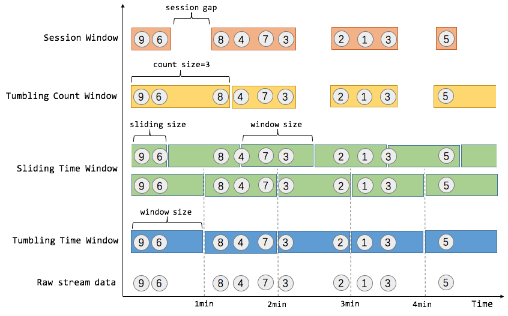

## 窗口

### 窗口类型
1. flink支持两种划分窗口的方式（time和count）    如果根据时间划分窗口，那么它就是一个time-window    如果根据数据划分窗口，那么它就是一个count-window

2. flink支持窗口的两个重要属性（size和interval）    

* 如果size=interval,那么就会形成tumbling-window(无重叠数据)    
* 如果size>interval,那么就会形成sliding-window(有重叠数据)    
* 如果size<interval,那么这种窗口将会丢失数据。比如每5秒钟，统计过去3秒的通过路口汽车的数据，将会漏掉2秒钟的数据。

3. 通过组合可以得出四种基本窗口：

* `time-tumbling-window` 无重叠数据的时间窗口，设置方式举例：timeWindow(Time.seconds(5)) 
   
* `time-sliding-window`  有重叠数据的时间窗口，设置方式举例：timeWindow(Time.seconds(5), Time.seconds(3)) 


* `count-tumbling-window`无重叠数据的数量窗口，设置方式举例：countWindow(5)    


* `count-sliding-window` 有重叠数据的数量窗口，设置方式举例：countWindow(5,3)
 
4. flink支持在stream上的通过key去区分多个窗口

      
### 窗口的实现方式 

上一张经典图：




* Tumbling Time Window

假如我们需要统计每一分钟中用户购买的商品的总数，需要将用户的行为事件按每一分钟进行切分，这种切分被成为翻滚时间窗口（Tumbling Time Window）。翻滚窗口能将数据流切分成不重叠的窗口，每一个事件只能属于一个窗口。

```
// 用户id和购买数量 stream
val counts: DataStream[(Int, Int)] = ...
val tumblingCnts: DataStream[(Int, Int)] = counts
  // 用userId分组
  .keyBy(0) 
  // 1分钟的翻滚窗口宽度
  .timeWindow(Time.minutes(1))
  // 计算购买数量
  .sum(1) 
```

* Sliding Time Window

我们可以每30秒计算一次最近一分钟用户购买的商品总数。这种窗口我们称为滑动时间窗口（Sliding Time Window）。在滑窗中，一个元素可以对应多个窗口。通过使用 DataStream API，我们可以这样实现：

```
val slidingCnts: DataStream[(Int, Int)] = buyCnts
  .keyBy(0) 
  .timeWindow(Time.minutes(1), Time.seconds(30))
  .sum(1)
```

* Tumbling Count Window

当我们想要每100个用户购买行为事件统计购买总数，那么每当窗口中填满100个元素了，就会对窗口进行计算，这种窗口我们称之为翻滚计数窗口（Tumbling Count Window），上图所示窗口大小为3个。通过使用 DataStream API，我们可以这样实现：

```
// Stream of (userId, buyCnts)
val buyCnts: DataStream[(Int, Int)] = ...

val tumblingCnts: DataStream[(Int, Int)] = buyCnts
  // key stream by sensorId
  .keyBy(0)
  // tumbling count window of 100 elements size
  .countWindow(100)
  // compute the buyCnt sum 
  .sum(1)
```

* Session Window

在这种用户交互事件流中，我们首先想到的是将事件聚合到会话窗口中（一段用户持续活跃的周期），由非活跃的间隙分隔开。如上图所示，就是需要计算每个用户在活跃期间总共购买的商品数量，如果用户30秒没有活动则视为会话断开（假设raw data stream是单个用户的购买行为流）。Session Window 的示例代码如下：


```
// Stream of (userId, buyCnts)
val buyCnts: DataStream[(Int, Int)] = ...
    
val sessionCnts: DataStream[(Int, Int)] = vehicleCnts
    .keyBy(0)
    // session window based on a 30 seconds session gap interval 
    .window(ProcessingTimeSessionWindows.withGap(Time.seconds(30)))
    .sum(1)
```

一般而言，window 是在无限的流上定义了一个有限的元素集合。这个集合可以是基于时间的，元素个数的，时间和个数结合的，会话间隙的，或者是自定义的。Flink 的 DataStream API 提供了简洁的算子来满足常用的窗口操作，同时提供了通用的窗口机制来允许用户自己定义窗口分配逻辑。

