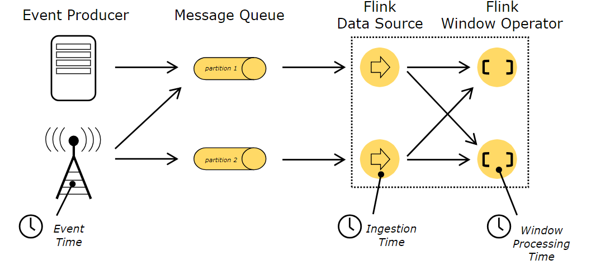

## 时间

### 时间类型

* Flink中的时间与现实世界中的时间是不一致的，在flink中被划分为**事件时间，摄入时间，处理时间**三种。

* 如果以EventTime为基准来定义时间窗口将形成EventTimeWindow,要求消息本身就应该携带EventTime

* 如果以IngesingtTime为基准来定义时间窗口将形成IngestingTimeWindow,以source的systemTime为准。

* 如果以ProcessingTime基准来定义时间窗口将形成ProcessingTimeWindow，以operator的systemTime为准。

### 时间详解

**Processing Time**

Processing Time 是指事件被处理时机器的系统时间。

当流程序在 Processing Time 上运行时，所有基于时间的操作(如时间窗口)将使用当时机器的系统时间。每小时 Processing Time 窗口将包括在系统时钟指示整个小时之间到达特定操作的所有事件。

例如，如果应用程序在上午 9:15 开始运行，则第一个每小时 Processing Time 窗口将包括在上午 9:15 到上午 10:00 之间处理的事件，下一个窗口将包括在上午 10:00 到 11:00 之间处理的事件。

Processing Time 是最简单的 “Time” 概念，不需要流和机器之间的协调，它提供了最好的性能和最低的延迟。但是，在分布式和异步的环境下，Processing Time 不能提供确定性，因为它容易受到事件到达系统的速度（例如从消息队列）、事件在系统内操作流动的速度以及中断的影响。

**Event Time**

Event Time 是事件发生的时间，一般就是数据本身携带的时间。这个时间通常是在事件到达 Flink 之前就确定的，并且可以从每个事件中获取到事件时间戳。在 Event Time 中，时间取决于数据，而跟其他没什么关系。Event Time 程序必须指定如何生成 Event Time 水印，这是表示 Event Time 进度的机制。

完美的说，无论事件什么时候到达或者其怎么排序，最后处理 Event Time 将产生完全一致和确定的结果。但是，除非事件按照已知顺序（按照事件的时间）到达，否则处理 Event Time 时将会因为要等待一些无序事件而产生一些延迟。由于只能等待一段有限的时间，因此就难以保证处理 Event Time 将产生完全一致和确定的结果。

假设所有数据都已到达， Event Time 操作将按照预期运行，即使在处理无序事件、延迟事件、重新处理历史数据时也会产生正确且一致的结果。 例如，每小时事件时间窗口将包含带有落入该小时的事件时间戳的所有记录，无论它们到达的顺序如何。

请注意，有时当 Event Time 程序实时处理实时数据时，它们将使用一些 Processing Time 操作，以确保它们及时进行。

**Ingestion Time**

Ingestion Time 是事件进入 Flink 的时间。 在源操作处，每个事件将源的当前时间作为时间戳，并且基于时间的操作（如时间窗口）会利用这个时间戳。

Ingestion Time 在概念上位于 Event Time 和 Processing Time 之间。 与 Processing Time 相比，它稍微贵一些，但结果更可预测。因为 Ingestion Time 使用稳定的时间戳（在源处分配一次），所以对事件的不同窗口操作将引用相同的时间戳，而在 Processing Time 中，每个窗口操作符可以将事件分配给不同的窗口（基于机器系统时间和到达延迟）。

与 Event Time 相比，Ingestion Time 程序无法处理任何无序事件或延迟数据，但程序不必指定如何生成水印。

在 Flink 中，Ingestion Time 与 Event Time 非常相似，但 Ingestion Time 具有自动分配时间戳和自动生成水印功能。

