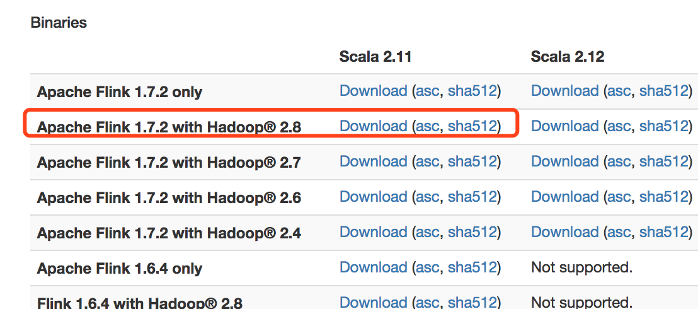
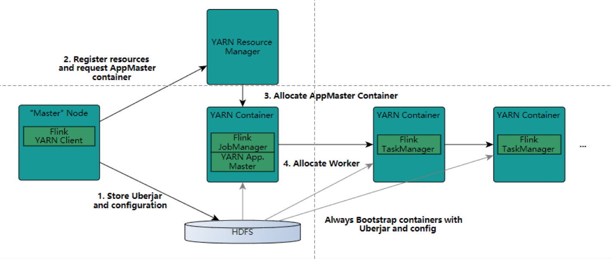
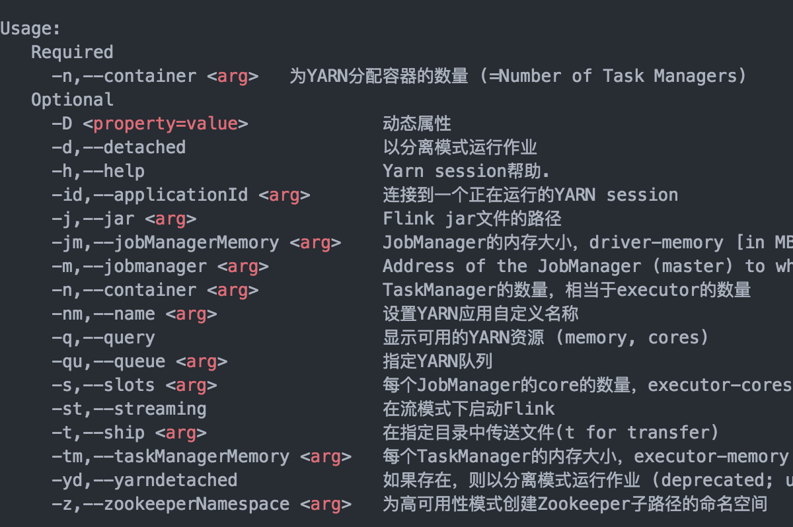

## 部署方式


一般来讲有三种方式：

* Local
* Standalone
* Flink On Yarn/Mesos/K8s…

## 单机模式

参考上一篇**Flink从入门到放弃(入门篇2)-本地环境搭建&构建第一个Flink应用**

## Standalone模式部署

我们基于CentOS7虚拟机搭建一个3个节点的集群：

角色分配：
```
Master: 192.168.246.134
Slave: 192.168.246.135
Slave: 192.168.246.136

```
```
192.168.246.134 jobmanager
192.168.246.135 taskmanager
192.168.246.136 taskmanager
```
假设三台机器都存在：
用户root 密码为123

```
192.168.246.134 master
192.168.246.135 slave1
192.168.246.136 slave2

```
三台机器首先要做ssh免登，具体方法很简单，可以百度。

下载一个包到本地：

这里我选择了1.7.2版本+Hadoop2.8+Scala2.11版本
然后，分发
```
scp flink-1.7.2-bin-hadoop28-scala_2.11.tgz root@192.168.246.13X:~
scp jdk-8u11-linux-x64.tar.gz root@192.168.246.13X:~
注意：X代表4、5、6，分发到3台机器

修改解压后目录属主：
Chown -R  root:root flink/
Chown -R root:root jdk8/

export JAVA_HOME=/root/jdk8
export JRE_HOME=${JAVA_HOME}/jre
export CLASSPATH=.:${JAVA_HOME}/lib:${JRE_HOME}/lib
export PATH=${JAVA_HOME}/bin:$PATH
```

分别修改master和slave的flink-conf.yaml文件
```
Vim  flink/conf/flink-conf.yaml

##配置master节点ip
jobmanager.rpc.address: 192.168.1.100

##配置slave节点可用内存，单位MB
taskmanager.heap.mb: 25600

##配置每个节点的可用slot，1 核CPU对应 1 slot
##the number of available CPUs per machine 
taskmanager.numberOfTaskSlots: 30

##默认并行度 1 slot资源
parallelism.default: 1

修改slave节点配置文件slaves：
192.168.246.135
192.168.246.136
```

启动集群：
```
##在master节点上执行此脚本，就可以启动集群，前提要保证master节点到slaver节点可以免密登录，
##因为它的启动过程是：先在master节点启动jobmanager进程，然后ssh到各slaver节点启动taskmanager进程
./bin/start-cluster.sh
停止集群：
./bin/stop-cluster.sh
```

## Flink on yarn集群部署

### Yarn的简介：


* ResourceManager
ResourceManager 负责整个集群的资源管理和分配，是一个全局的资源管理系统。 NodeManager 以心跳的方式向 ResourceManager 汇报资源使用情况（目前主要是 CPU 和内存的使用情况）。RM 只接受 NM 的资源回报信息，对于具体的资源处理则交给 NM 自己处理。
* NodeManager
NodeManager 是每个节点上的资源和任务管理器，它是管理这台机器的代理，负责该节点程序的运行，以及该节点资源的管理和监控。YARN 集群每个节点都运行一个NodeManager。
NodeManager 定时向 ResourceManager 汇报本节点资源（CPU、内存）的使用情况和Container 的运行状态。当 ResourceManager 宕机时 NodeManager 自动连接 RM 备用节点。
NodeManager 接收并处理来自 ApplicationMaster 的 Container 启动、停止等各种请求。
* ApplicationMaster
负责与 RM 调度器协商以获取资源（用 Container 表示）。 
将得到的任务进一步分配给内部的任务(资源的二次分配)。 
与 NM 通信以启动/停止任务。 
监控所有任务运行状态，并在任务运行失败时重新为任务申请资源以重启任务

### Flink on yarn 集群启动步骤

* 步骤1　用户向YARN中提交应用程序，其中包括ApplicationMaster程序、启动ApplicationMaster的命令、用户程序等。
* 步骤2　ResourceManager为该应用程序分配第一个Container，并与对应的Node-Manager通信，要求它在这个Container中启动应用程序的ApplicationMaster。
* 步骤3　ApplicationMaster首先向ResourceManager注册，这样用户可以直接通过ResourceManager查看应用程序的运行状态，然后它将为各个任务申请资源，并监控它的运行状态，直到运行结束，即重复步骤4~7。
* 步骤4　ApplicationMaster采用轮询的方式通过RPC协议向ResourceManager申请和领取资源。
* 步骤5　一旦ApplicationMaster申请到资源后，便与对应的NodeManager通信，要求它启动任务。
* 步骤6　NodeManager为任务设置好运行环境（包括环境变量、JAR包、二进制程序等）后，将任务启动命令写到一个脚本中，并通过运行该脚本启动任务。
* 步骤7　各个任务通过某个RPC协议向ApplicationMaster汇报自己的状态和进度，以让ApplicationMaster随时掌握各个任务的运行状态，从而可以在任务失败时重新启动任务。  在应用程序运行过程中，用户可随时通过RPC向ApplicationMaster查询应用程序的当前运行状态。
* 步骤8　应用程序运行完成后，ApplicationMaster向ResourceManager注销并关闭自己


### on yarn 集群部署

设置Hadoop环境变量：
```
[root@hadoop2 flink-1.7.2]# vi /etc/profile
export HADOOP_CONF_DIR=这里是你自己的hadoop路径
```

bin/yarn-session.sh -h 查看使用方法:




在启动的是可以指定TaskManager的个数以及内存(默认是1G)，也可以指定JobManager的内存，但是JobManager的个数只能是一个

我们开启动一个YARN session：
```
./bin/yarn-session.sh -n 4 -tm 8192 -s 8

```

上面命令启动了4个TaskManager，每个TaskManager内存为8G且占用了8个核(是每个TaskManager，默认是1个核)。在启动YARN session的时候会加载conf/flink-config.yaml配置文件，我们可以根据自己的需求去修改里面的相关参数.

YARN session启动之后就可以使用bin/flink来启动提交作业:

例如：
```
./bin/flink run -c com.demo.wangzhiwu.WordCount $DEMO_DIR/target/flink-demo-1.0.SNAPSHOT.jar --port 9000
```

flink run的用法如下：
```
用法: run [OPTIONS] <jar-file> <arguments>  
  "run" 操作参数:  
     -c,--class <classname>           如果没有在jar包中指定入口类，则需要在这里通过这个参数指定  

     -m,--jobmanager <host:port>      指定需要连接的jobmanager(主节点)地址  
                                      使用这个参数可以指定一个不同于配置文件中的jobmanager  
     -p,--parallelism <parallelism>   指定程序的并行度。可以覆盖配置文件中的默认值。  
```

使用run 命令向yarn集群提交一个job。客户端可以确定jobmanager的地址。当然，你也可以通过-m参数指定jobmanager。jobmanager的地址在yarn控制台上可以看到。

值得注意的是：

上面的YARN session是在Hadoop YARN环境下启动一个Flink cluster集群，里面的资源是可以共享给其他的Flink作业。我们还可以在YARN上启动一个Flink作业。这里我们还是使用./bin/flink，但是不需要事先启动YARN session：
```
./bin/flink run -m yarn-cluster -yn 2 ./examples/batch/WordCount.jar      \
          --input hdfs://user/hadoop/input.txt                            \
          --output hdfs://user/hadoop/output.txt
```

上面的命令同样会启动一个类似于YARN session启动的页面。其中的-yn是指TaskManager的个数，必须要指定。

#### 后台运行 yarn session

如果你不希望flink yarn client一直运行，也可以启动一个后台运行的yarn session。使用这个参数：-d 或者 --detached
在这种情况下，flink yarn client将会只提交任务到集群然后关闭自己。注意：在这种情况下，无法使用flink停止yarn session。
必须使用yarn工具来停止yarn session

```
yarn application -kill <applicationId> 
```

#### flink on yarn的故障恢复

flink 的 yarn 客户端通过下面的配置参数来控制容器的故障恢复。这些参数可以通过conf/flink-conf.yaml 或者在启动yarn session的时候通过-D参数来指定。

* yarn.reallocate-failed：这个参数控制了flink是否应该重新分配失败的taskmanager容器。默认是true。
* yarn.maximum-failed-containers：applicationMaster可以接受的容器最大失败次数，达到这个参数，就会认为yarn session失败。默认这个次数和初始化请求的taskmanager数量相等(-n 参数指定的)。
* yarn.application-attempts：applicationMaster重试的次数。如果这个值被设置为1(默认就是1)，当application master失败的时候，yarn session也会失败。设置一个比较大的值的话，yarn会尝试重启applicationMaster。

#### 日志文件查看

在某种情况下，flink yarn session 部署失败是由于它自身的原因，用户必须依赖于yarn的日志来进行分析。最有用的就是yarn log aggregation 。启动它，用户必须在yarn-site.xml文件中设置yarn.log-aggregation-enable 属性为true。一旦启用了，用户可以通过下面的命令来查看一个失败的yarn session的所有详细日志。

```
yarn logs -applicationId <application ID>  
```

完。