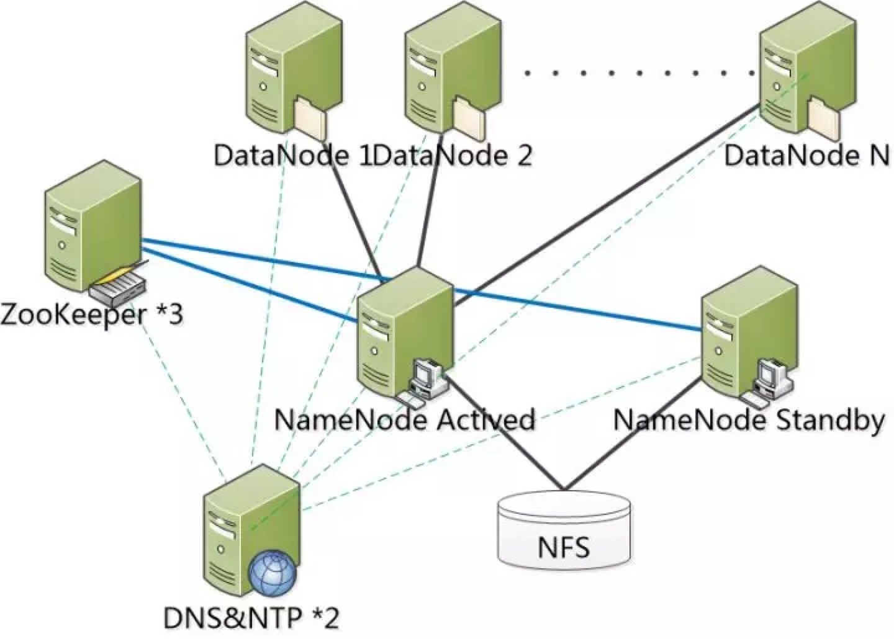
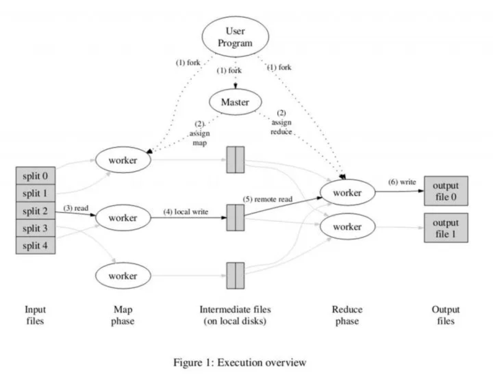
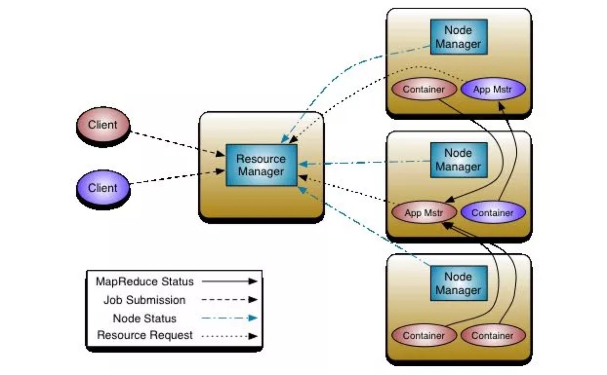

其实Hadoop诞生至今已经十多年了，网络上也充斥着关于Hadoop相关知识的海量资源。但是，有时还是会使刚刚接触大数据领域的童鞋分不清hadoop、hdfs、Yarn和MapReduce等等技术词汇。

Hadoop是ASF(Apache软件基金会)开源的，根据Google开源的三篇大数据论文设计的，一个能够允许大量数据在计算机集群中，通过使用简单的编程模型进行分布式处理的框架。其设计的规模可从单一的服务器到数千台服务器，每一个均可提供局部运算和存储功能。Hadoop并不依赖昂贵的硬件以支持高可用性。Hadoop可以检测并处理应用层上的错误，并可以把错误转移到其他服务器上(让它错误，我在用别的服务器顶上就可以了)，所以Hadoop提供一个基于计算机集群的、高效性的服务。

经过十年的发展，Hadoop这个名词的本身也在不断进化者，目前我们提到Hadoop大多是指大数据的生态圈，这个生态圈包括众多的软件技术(e.g.  HBase、Hive和Spark等等)。

有如Spring框架有着最基础的几个模块Context、Bean和Core，其他的模块和项目都是基于这些基础模块构建。Hadoop与之一样，也有最基础的几个模块。

**Common**: 支持其他模块的公用工具包。


**HDFS**: 一个可高吞吐访问应用数据的分布式文件系统。

**YARN**: 一个管理集群服务器资源和任务调度的框架。

**MapReduce**: 基于Yarn对大数据集进行并行计算的系统。

其它的，像HBase、Hive等等不过在这几个基础模块上的高级抽象。另外Hadoop也不是目前大数据的唯一解决方案，像Amazon的大数据技术方案等等。

Common
Common模块是Hadoop最为基础的模块，他为其他模块提供了像操作文件系统、I/O、序列化和远程方法调用等最为基础的实现。如果想深入的了解Hadoop的具体实现，可以阅读一下Common的源码。

## HDFS
HDFS是“Hadoop Distributed File System”的首字母缩写，是一种设计运行在一般硬件条件（不需要一定是服务器级别的设备，但更好的设备能发挥更大的作用）下的分布式文件系统. 他和现有的其他分布式文件系统(e.g. RAID)有很多相似的地方。和其他分布式文件系统的不同之处是HDFS设计为运行在低成本的硬件上(e.g. 普通的PC机)，且提供高可靠性的服务器. HDFS设计满足大数据量，大吞吐量的应用情况。

为了更好的理解分布式文件系统，我们先从文件讲起。

### 文件

文件这个词，恐怕只要是现代人都不会陌生。但是在不同行业中，文件有着不同的意义。在计算机科学领域，文件是什么呢？文件是可以在目录中看的见的图标么？当然不是。文件在存储设备时，是个N长的字节序列。而在一个计算机使用者的角度而言，文件是对所有I/O设备的抽象。每个I/O设备都可以视为文件，包括磁盘、键盘和网络等。文件这个简单而精致的概念其内涵是十分丰富的，它向应用程序提供了一个统一的视角，来看待系统中可能含有的各式各样的I/O设备。

### 文件系统

那么一台计算机上肯定不止一个文件，成千上万的文件怎么管理呢？因此需要我们需要一种对文件进行管理的东西，即文件系统。文件系统是一种在计算机上存储和组织数据的方法，它使得对其访问和查找变得容易，文件系统使用文件和树形目录的抽象逻辑概念代替了硬盘和光盘等物理设备使用数据块的概念，用户使用文件系统来保存数据而不必关心数据实际保存在硬盘的地址为多少的数据块上，只需要记住这个文件的所属目录和文件名。在写入新数据之前，用户不必关心硬盘上的那个块地址没有被使用，硬盘上的存储空间管理(分配和释放)功能由文件系统自动完成，用户只需要记住数据被写入到了哪个文件中即可。

### 分布式文件系统

相对于单机的文件系统而言，分布式文件系统(Distributed file system)。是一种允许文件通过网络在多台主机上分享的文件系统，可让多计算机上的多用户分享文件和存储空间。

在这样的文件系统中，客户端并非直接访问底层的数据存储区块和磁盘。而是通过网络，基于单机文件系统并借由特定的通信协议的帮助，来实现对于文件系统的读写。

分布式文件系统需要拥有的最基本的能力是通过畅通网络I/O来实现数据的复制与容错。也就是说，一方面一个文件是分为多个数据块分布在多个设备中。另一方面，数据块有多个副本分布在不同的设备上。即使有一小部分的设备出现离线和宕机等情况，整体来说文件系统仍然可以持续运作而不会有数据损失。

注意:分布式文件系统和分布式数据存储的界线是模糊的，但一般来说，分布式文件系统是被设计用在局域网，比较强调的是传统文件系统概念的延伸，并通过软件方法来达成容错的目的。而分布式数据存储，则是泛指应用分布式运算技术的文件和数据库等提供数据存储服务的系统。

### HDFS

HDFS正是Hadoop中负责分布式文件系统的。HDFS采用master/slave架构。一个HDFS集群是由一个Namenode和一定数目的Datanodes组成。Namenode是一个中心服务器，负责管理文件系统的命名空间以及文件的访问控制。集群中的Datanode一般是一个设备上部署一个，负责管理它所在节点上的存储。HDFS暴露了文件系统的命名空间，用户能够以文件的形式在上面存储数据。实际上，一个文件会被分成一个或多个数据块，这些块存储在一组Datanode上。Namenode执行文件系统的命名空间操作，比如打开、关闭、重命名文件或目录。它也负责确定数据块到具体Datanode设备的映射。Datanode负责处理文件系统客户端的读写请求。在Namenode的统一调度下进行数据块的创建、删除和复制。为了保证文件系统的高可靠，往往需要另一个Standby的Namenode在Actived Namenode出现问题后，立刻接管文件系统。

网络上有很多关于hdfs的安装配置手册，本文就不再复述。只提供一个以前项目中应用过的部署架构仅供大家参考。




这个高可用的HDFS架构是由3台zookeeper设备、2台域名服务(DNS)和时间服务(NTP)设备、2台Namenode设备(如果必要Standby可以更多)、一个共享存储设备(NFS)和N个DataNode组成。

Zookeeper负责接受NameNode的心跳，当Actived namenode不向zookeeper报告心跳时，Standby Namenode的监控进程会收到这个消息，从而激活Standby NameNode并接管Active NameNode的工作。

NFS负责为2个NameNode存储EditLog文件，(NameNode 在执行 HDFS 客户端提交的创建文件或者移动文件这样的写操作时，会首先把这些操作记录在 EditLog 文件之中，然后再更新内存中的文件系统镜像，最终再刷新到磁盘。 EditLog 只是在数据恢复的时候起作用。记录在 EditLog 之中的每一个操作又称为一个事务，每个事务有一个整数形式的事务 id 作为编号。EditLog 会被切割为很多段，每一段称为一个 Segment)当发生NameNode切换的情况时，Standby NameNode接管后，会根据EditLog中把未完成的写操作继续下去并开使向EditLog写入新的写操作记录。(此外，hadoop还提供了另一种QJM的EditLog方案)

DNS&NTP分布负责整个系统的(包括客户端)域名服务和时间服务。这个在集群部署中是非常有必要的两个存在。首先说一下DNS的必要性，一、Hadoop是极力提倡用机器名作为在HDFS环境中的标识。二、当然可以在/etc/hosts文件中去标明机器名和IP的映射关系，可是请想想如果在一个数千台设备的集群中添加一个设备时，负责系统维护的伙伴会不会骂集群的设计者呢？其次是NTP的必要性，在刚刚开始接触Hadoop集群时我遇到的大概90%的问题是由于各个设备时间不一致导致的。各个设备的时间同步是数据一致性和管理一致性的一个基本保障。

### MapReduce
MapReduce是一个使用简单的软件框架，基于它写出来的应用程序能够运行在由上千个商用机器组成的大型集群上，并以一种可靠容错的方式并行处理上T级别的数据集。

一个MapReduce 作业(job)通常会把输入的数据集切分为若干独立的数据块，由 map任务(task)以完全并行的方式处理它们。框架会对map的输出先进行排序， 然后把结果输入给reduce任务。通常作业的输入和输出都会被存储在文件系统中。 整个框架负责任务的调度和监控，以及重新执行已经失败的任务。

通常，MapReduce框架和HDFS是运行在一相同的设备集群上的，也就是说，计算设备和存储设备通常在一起。这种配置允许框架在那些已经存好数据的设备上高效地调度任务，这可以使整个集群的网络带宽被非常高效地利用。

MapReduce框架由一个单独的master JobTracker 和每个集群设备一个slave TaskTracker共同组成。master负责调度构成一个作业的所有任务，这些任务分布在不同的slave上，master监控它们的执行，重新执行已经失败的任务。而slave仅负责执行由master指派的任务。

用户编写的MapReduce应用程序应该指明输入/输出的文件位置(路径)，并通过实现合适的接口或抽象类提供map和reduce函数。再加上其他作业的参数，就构成了作业配置(job configuration)。然后，job client提交作业(jar包/可执行程序等)和配置信息给JobTracker，后者负责分发这些软件和配置信息给slave、调度任务并监控它们的执行，同时提供状态和诊断信息给job-client。




在抽象的层面上MapReduce是由两个函数Map和Reduce组成的。简单来说，一个Map函数就是对一些独立元素组成的概念上的列表的每一个元素进行指定的操作。事实上，每个元素都是被独立操作的，而原始列表没有被更改，因为这里创建了一个新的列表来保存操作结果。这就是说，Map操作是可以高度并行的。而Reduce函数指的是对Map函数的结果（中间经过洗牌的过程，会把map的结果进行分组）分组后多个列表的元素进行适当的归并。

注意:虽然Hadoop框架是用JavaTM实现的，但MapReduce应用程序则不一定要用 Java来写 。至少Scala是可以写的哟。

附上Scala实现的计算词频的Scala源码

    
```
import java.io.IOException
import java.util.StringTokenizer

import org.apache.hadoop.conf.Configuration
import org.apache.hadoop.fs.Path
import org.apache.hadoop.io.{IntWritable, Text}
import org.apache.hadoop.mapreduce.lib.input.FileInputFormat
import org.apache.hadoop.mapreduce.lib.output.FileOutputFormat
import org.apache.hadoop.mapreduce.{Job, Mapper, Reducer}

import scala.collection.JavaConversions

object WordCount {
def main(args: Array[String]): Unit = {
val job = new Job(new Configuration(), "WordCount")
job.setJarByClass(classOf[WordMapper]);
job.setMapperClass(classOf[WordMapper]);
job.setCombinerClass(classOf[WordReducer]);
job.setReducerClass(classOf[WordReducer]);
job.setOutputKeyClass(classOf[Text]);
job.setOutputValueClass(classOf[IntWritable]);
job.setNumReduceTasks(1)
FileInputFormat.addInputPath(job, new Path(args(0)));
FileOutputFormat.setOutputPath(job, new Path(args(1)));
System.exit(job.waitForCompletion(true) match { case true => 0
case false => 1
});
}
}

class WordMapper extends Mapper[Object, Text, Text, IntWritable] {
val one = new IntWritable(1)

@throws[IOException]
@throws[InterruptedException]
override def map(key: Object, value: Text, context: Mapper[Object, Text, Text, IntWritable]#Context) = {
val stringTokenizer = new StringTokenizer(value.toString());
while (stringTokenizer.hasMoreTokens()) {
context.write(new Text(stringTokenizer.nextToken()), one);
}
}
}

class WordReducer extends Reducer[Text, IntWritable, Text, IntWritable] {
@throws[IOException]
@throws[InterruptedException]
override def reduce(key: Text, values: java.lang.Iterable[IntWritable], context: Reducer[Text, IntWritable, Text, IntWritable]#Context) = {
import JavaConversions.iterableAsScalaIterable
context.write(key, new IntWritable(values.map(x=>x.get()).reduce(_+_)));
}
}
```

### Yarn
YARN(Yet Another Resource Negotiator)是Hadoop的设备资源管理器，它是一个通用资源管理系统，MapReduce和其他上层应用提供统一的资源管理和调度，它为集群在利用率、资源统一管理和数据共享等方面提供了巨大的帮助。

Yarn由ResourceManager、NodeManager、ApplicationMaster和Containe四个概念构成。



ResourceManager是一个全局的资源管理器，负责整个系统的资源管理和分配。它主要由两个组件构成:调度器(Scheduler)和应用程序管理器(Applications Manager)。调度器根据容量、队列等限制条件，将系统中的资源分配给各个正在运行的MapReduce程序。应用程序管理器负责管理整个系统中所有MapReduce程序，包括提交、与调度器协商资源以启动ApplicationMaster、监控ApplicationMaster运行状态并在失败时重新启动它等。

用户提交的每个MapReduce程序均包含一个ApplicationMaster，主要功能包括：与ResourceManager调度器协商以获取资源(用Container表示)；将得到的任务进一步分配给内部的任务(资源的二次分配)；与NodeManager通信以启动/停止任务；监控所有任务运行状态，并在任务运行失败时重新为任务申请资源以重启任务。

NodeManager是每个设备上的资源和任务管理器，一方面，它会定时地向ResourceManager汇报本设备上的资源使用情况和各个Container的运行状态；另一方面，它接收并处理来自ApplicationMaster的Container启动/停止等各种请求。

Container是YARN中的资源抽象，它封装了某个设备上的多维度资源，如内存、CPU、磁盘、网络等，当AM向RM申请资源时，RM为AM返回的资源便是用Container表示。

## 结语
本文走马观花的介绍了Hadoop相关内容。文章的主要目的是给大家一个对大数据的分布式解决方案的感官印象，为后面的大数据相关文章提供一个基础的理解。最后要强调的是，思考大数据方向的问题是一定要记住分布式的概念，因为你的数据并不在一个设备中甚至不再一个集群中，而且计算也是分布的。所以在设计大数据应用程序时，要花时间思考程序和算法在单机应用和分布式应用所产生的不同(e.g. 加权平均值)。

