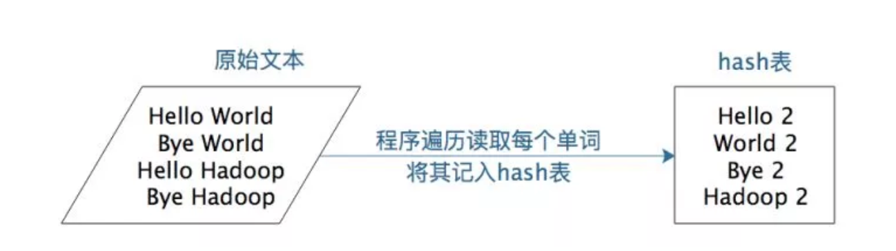
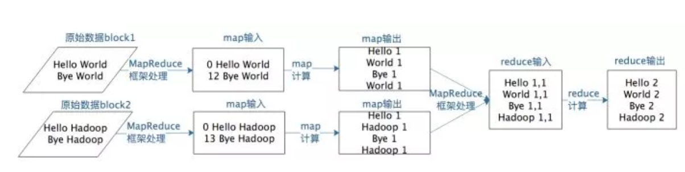
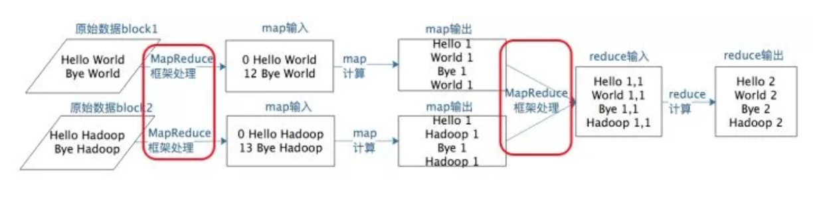
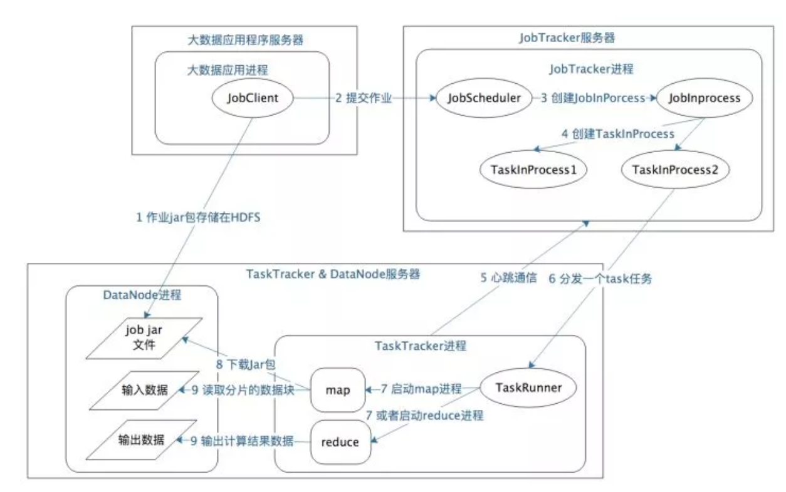

Hadoop解决大规模数据分布式计算的方案是MapReduce。MapReduce既是一个编程模型，又是一个计算框架。也就是说，开发人员必须基于MapReduce编程模型进行编程开发，然后将程序通过MapReduce计算框架分发到Hadoop集群中运行。我们先看一下作为编程模型的MapReduce。

### MapReduce编程模型

MapReduce是一种非常简单又非常强大的编程模型。

简单在于其编程模型只包含map和reduce两个过程，map的主要输入是一对<key , value>值，经过map计算后输出一对<key , value>值；然后将相同key合并，形成<key , value集合>；再将这个<key , value集合>输入reduce，经过计算输出零个或多个<key , value>对。

但是MapReduce同时又是非常强大的，不管是关系代数运算（SQL计算），还是矩阵运算（图计算），大数据领域几乎所有的计算需求都可以通过MapReduce编程来实现。

我们以WordCount程序为例。WordCount主要解决文本处理中的词频统计问题，就是统计文本中每一个单词出现的次数。如果只是统计一篇文章的词频，几十K到几M的数据，那么写一个程序，将数据读入内存，建一个Hash表记录每个词出现的次数就可以了，如下图。





但是如果想统计全世界互联网所有网页（数万亿计）的词频数（这正是google这样的搜索引擎典型需求），你不可能写一个程序把全世界的网页都读入内存，这时候就需要用MapReduce编程来解决。

WordCount的MapReduce程序如下。

```
public class WordCount {

public static class TokenizerMapper
extends Mapper<Object, Text, Text, IntWritable>{

private final static IntWritable one = new IntWritable(1);
private Text word = new Text();

public void map(Object key, Text value, Context context
) throws IOException, InterruptedException {
StringTokenizer itr = new StringTokenizer(value.toString());
while (itr.hasMoreTokens()) {
word.set(itr.nextToken());
context.write(word, one);
}
}
}

public static class IntSumReducer
extends Reducer<Text,IntWritable,Text,IntWritable> {
private IntWritable result = new IntWritable();

public void reduce(Text key, Iterable<IntWritable> values,
Context context
) throws IOException, InterruptedException {
int sum = 0;
for (IntWritable val : values) {
sum += val.get();
}
result.set(sum);
context.write(key, result);
}
}
}
```
其核心是一个map函数，一个reduce函数。

map函数的输入主要是一个<key , value>对，在这个例子里，value是要统计的所有文本中的一行数据，key在这里不重要，我们忽略。
```
public void map(Object key, Text value, Context context)
```
map函数的计算过程就是，将这行文本中的单词提取出来，针对每个单词输出一个<word , 1>这样的<key , value>对。

MapReduce计算框架会将这些<word , 1>收集起来，将相同的word放在一起，形成<word , <1,1,1,1,1,1,1.....>>这样的<key , value集合>数据，然后将其输入给reduce函数。
```
public void reduce(Text key, Iterable<IntWritable> values,Context context)
```
这里的reduce的输入参数values就是由很多个1组成的集合，而key就是具体的单词word。

reduce函数的计算过程就是，将这个集合里的1求和，再将单词（word）和这个和（sum）组成一个<key , value>(<word , sum>)输出。每一个输出就是一个单词和它的词频统计总和。

假设有两个block的文本数据需要进行词频统计，MapReduce计算过程如下图。



### MapReduce计算过程


一个map函数可以针对一部分数据进行运算，这样就可以将一个大数据切分成很多块（这也正是HDFS所做的），MapReduce计算框架为每个块分配一个map函数去计算，从而实现大数据的分布式计算。

上面提到MapReduce编程模型将大数据计算过程切分为map和reduce两个阶段，在map阶段为每个数据块分配一个map计算任务，然后将所有map输出的key进行合并，相同的key及其对应的value发送给同一个reduce任务去处理。

这个过程有两个关键问题需要处理

* 如何为每个数据块分配一个map计算任务，代码是如何发送数据块所在服务器的，发送过去是如何启动的，启动以后又如何知道自己需要计算的数据在文件什么位置（数据块id是什么）

* 处于不同服务器的map输出的<key , value> ，如何把相同的key聚合在一起发送给reduce任务

* 这两个关键问题正好对应文章中“MapReduce计算过程”一图中两处“MapReduce框架处理”。





我们先看下MapReduce是如何启动处理一个大数据计算应用作业的。

#### MapReduce作业启动和运行机制

我们以Hadoop1为例，MapReduce运行过程涉及以下几类关键进程：

* 大数据应用进程：启动用户MapReduce程序的主入口，主要指定Map和Reduce类、输入输出文件路径等，并提交作业给Hadoop集群。

* JobTracker进程：根据要处理的输入数据量启动相应数量的map和reduce进程任务，并管理整个作业生命周期的任务调度和监控。JobTracker进程在整个Hadoop集群全局唯一。

* TaskTracker进程：负责启动和管理map进程以及reduce进程。因为需要每个数据块都有对应的map函数，TaskTracker进程通常和HDFS的DataNode进程启动在同一个服务器，也就是说，Hadoop集群中绝大多数服务器同时运行DataNode进程和TaskTacker进程。

如下图所示。





具体作业启动和计算过程如下：

* 应用进程将用户作业jar包存储在HDFS中，将来这些jar包会分发给Hadoop集群中的服务器执行MapReduce计算。
* 应用程序提交job作业给JobTracker。
* JobTacker根据作业调度策略创建JobInProcess树，每个作业都会有一个自己的JobInProcess树。
* JobInProcess根据输入数据分片数目（通常情况就是数据块的数目）和设置的reduce数目创建相应数量的TaskInProcess。
* TaskTracker进程和JobTracker进程进行定时通信。
* 如果TaskTracker有空闲的计算资源（空闲CPU核），JobTracker就会给他分配任务。分配任务的时候会根据TaskTracker的服务器名字匹配在同一台机器上的数据块计算任务给它，使启动的计算任务正好处理本机上的数据。
* TaskRunner收到任务后根据任务类型（map还是reduce），任务参数（作业jar包路径，输入数据文件路径，要处理的数据在文件中的起始位置和偏移量，数据块多个备份的DataNode主机名等）启动相应的map或者reduce进程。
* map或者reduce程序启动后，检查本地是否有要执行任务的jar包文件，如果没有，就去HDFS上下载，然后加载map或者reduce代码开始执行。
* 如果是map进程，从HDFS读取数据（通常要读取的数据块正好存储在本机）。如果是reduce进程，将结果数据写出到HDFS。

通过以上过程，MapReduce可以将大数据作业计算任务分布在整个Hadoop集群中运行，每个map计算任务要处理的数据通常都能从本地磁盘上读取到。而用户要做的仅仅是编写一个map函数和一个reduce函数就可以了，根本不用关心这两个函数是如何被分布启动到集群上的，数据块又是如何分配给计算任务的。这一切都由MapReduce计算框架完成。

#### MapReduce数据合并与连接机制
在WordCount例子中，要统计相同单词在所有输入数据中出现的次数，而一个map只能处理一部分数据，一个热门单词几乎会出现在所有的map中，这些单词必须要合并到一起进行统计才能得到正确的结果。

事实上，几乎所有的大数据计算场景都需要处理数据关联的问题，简单如WordCount只要对key进行合并就可以了，复杂如数据库的join操作，需要对两种类型（或者更多类型）的数据根据key进行连接。

MapReduce计算框架处理数据合并与连接的操作就在map输出与reduce输入之间，这个过程有个专门的词汇来描述，叫做shuffle。

#### MapReduce shuffle过程
每个map任务的计算结果都会写入到本地文件系统，等map任务快要计算完成的时候，MapReduce计算框架会启动shuffle过程，在map端调用一个Partitioner接口，对map产生的每个<key , value>进行reduce分区选择，然后通过http通信发送给对应的reduce进程。这样不管map位于哪个服务器节点，相同的key一定会被发送给相同的reduce进程。reduce端对收到的<key , value>进行排序和合并，相同的key放在一起，组成一个<key , value集合>传递给reduce执行。

MapReduce框架缺省的Partitioner用key的哈希值对reduce任务数量取模，相同的key一定会落在相同的reduce任务id上，实现上，这样的Partitioner代码只需要一行，如下所示。

```
/** Use {@link Object#hashCode()} to partition. */ 
public int getPartition(K2 key, V2 value, int numReduceTasks) { 
return (key.hashCode() & Integer.MAX_VALUE) % numReduceTasks; 
}
```

shuffle是大数据计算过程中发生奇迹的地方，不管是MapReduce还是Spark，只要是大数据批处理计算，一定会有shuffle过程，让数据关联起来，数据的内在关系和价值才会呈现出来。不理解shuffle，就会在map和reduce编程中产生困惑，不知道该如何正确设计map的输出和reduce的输入。shuffle也是整个MapReduce过程中最难最消耗性能的地方，在MapReduce早期代码中，一半代码都是关于shuffle处理的。


