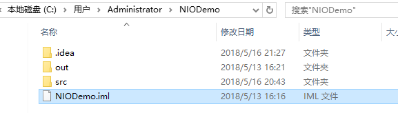

### **Java高级特性增强-NIO
本部分网络上有大量的资源可以参考，在这里做了部分整理并做了部分勘误，感谢前辈的付出，每节文章末尾有引用列表~
* * *
**写在所有文字的前面**：作者在此特别推荐Google排名第一的关于NIO的文章：
http://tutorials.jenkov.com/java-nio/index.html
虽然是英文的，但是看下来并不困难。后面如果各位看官呼声很高，作者会翻译这一系列文章。

## Java NIO之拥抱Path和Files

#### 文件I/O基石：Path

Java7中文件IO发生了很大的变化，专门引入了很多新的类来取代原来的基于java.io.File的文件IO操作方式:
```
import java.nio.file.DirectoryStream;
import java.nio.file.FileSystem;
import java.nio.file.FileSystems;
import java.nio.file.Files;
import java.nio.file.Path;
import java.nio.file.Paths;
import java.nio.file.attribute.FileAttribute;
import java.nio.file.attribute.PosixFilePermission;
import java.nio.file.attribute.PosixFilePermissions;·
......
```
我们将从下面几个方面来学习Path类:

* 创建一个Path
* File和Path之间的转换，File和URI之间的转换
* 获取Path的相关信息
* 移除Path中的冗余项

**1 创建一个Path**
创建Path实例可以通过 Paths工具类 的 get（）方法：
```
//使用绝对路径
 Path path= Paths.get("c:\\data\\myfile.txt");
//使用相对路径
Path path = Paths.get("/home/jakobjenkov/myfile.txt");
```
下面这种创建方式和上面等效：
```
Path path = FileSystems.getDefault().getPath("c:\\data\\myfile.txt");
```
**2 File和Path之间的转换，File和URI之间的转换**
```
        File file = new File("C:/my.ini");
        Path p1 = file.toPath();
        p1.toFile();
        file.toURI();
```
**3 获取Path的相关信息**
       
 ```
        //使用Paths工具类的get()方法创建
        Path path = Paths.get("D:\\XMind\\bcl-java.txt");
        System.out.println("文件名：" + path.getFileName());
        System.out.println("名称元素的数量：" + path.getNameCount());
        System.out.println("父路径：" + path.getParent());
        System.out.println("根路径：" + path.getRoot());
        System.out.println("是否是绝对路径：" + path.isAbsolute());
        //startsWith()方法的参数既可以是字符串也可以是Path对象
        System.out.println("是否是以为给定的路径D:开始：" + path.startsWith("D:\\") );
        System.out.println("该路径的字符串形式：" + path.toString());
```
结果：
```
文件名：bcl-java.txt
名称元素的数量：2
父路径：D:\XMind
根路径：D:\
是否是绝对路径：true
是否是以为给定的路径D:开始：true
该路径的字符串形式：D:\XMind\bcl-java.txt
```
**4 移除冗余项**
某些时候在我们需要处理的Path路径中可能会有一个或两个点

* .表示的是当前目录
* ..表示父目录或者说是上一级目录：

下面通过实例来演示一下使用Path类的normalize()和toRealPath()方法把.和..去除。

* normalize() : 返回一个路径，该路径是冗余名称元素的消除。
* toRealPath() : 融合了toAbsolutePath()方法和normalize()方法
```

        //.表示的是当前目录
        Path currentDir = Paths.get(".");
        System.out.println(currentDir.toAbsolutePath());//输出C:\Users\Administrator\NIODemo\.
        Path currentDir2 = Paths.get(".\\NIODemo.iml");
        System.out.println("原始路径格式："+currentDir2.toAbsolutePath());
        System.out.println("执行normalize（）方法之后："+currentDir2.toAbsolutePath().normalize());
        System.out.println("执行toRealPath()方法之后："+currentDir2.toRealPath());
        //..表示父目录或者说是上一级目录：
        Path currentDir3 = Paths.get("..");
        System.out.println("原始路径格式："+currentDir3.toAbsolutePath());
        System.out.println("执行normalize（）方法之后："+currentDir3.toAbsolutePath().normalize());
        System.out.println("执行toRealPath()方法之后："+currentDir3.toRealPath());
```
结果：
```
C:\Users\Administrator\NIODemo\.
原始路径格式：C:\Users\Administrator\NIODemo\.\NIODemo.iml
执行normalize（）方法之后：C:\Users\Administrator\NIODemo\NIODemo.iml
执行toRealPath()方法之后：C:\Users\Administrator\NIODemo\NIODemo.iml
原始路径格式：C:\Users\Administrator\NIODemo\..
执行normalize（）方法之后：C:\Users\Administrator
执行toRealPath()方法之后：C:\Users\Administrator
```


#### 拥抱Files类
Java NIO中的Files类（java.nio.file.Files）提供了多种操作文件系统中文件的方法。本节教程将覆盖大部分方法。Files类包含了很多方法，所以如果本文没有提到的你也可以直接查询JavaDoc文档。
java.nio.file.Files类是和java.nio.file.Path相结合使用的

**1 检查给定的Path在文件系统中是否存在**
通过 Files.exists() 检测文件路径是否存在：
```
       Path path = Paths.get("D:\\XMind\\bcl-java.txt");
        boolean pathExists =
                Files.exists(path,
                        new LinkOption[]{LinkOption.NOFOLLOW_LINKS});
        System.out.println(pathExists);//true
```
注意Files.exists()的第二个参数。它是一个数组，这个参数直接影响到Files.exists()如何确定一个路径是否存在。在本例中，这个数组内包含了LinkOptions.NOFOLLOW_LINKS，表示检测时不包含符号链接文件。

**2 创建文件/文件夹**

**创建文件：**
通过 Files.createFile() 创建文件:
```
        Path target2 = Paths.get("C:\\mystuff.txt");
        try {
            if(!Files.exists(target2))
                Files.createFile(target2);
        } catch (IOException e) {
            e.printStackTrace();
        }
```
**创建文件夹：**

* 通过 Files.createDirectory() 创建文件夹
* 通过 Files.createDirectories() 创建文件夹

Files.createDirectories()会首先创建所有不存在的父目录来创建目录，而Files.createDirectory()方法只是创建目录，如果它的上级目录不存在就会报错。比如下面的程序使用Files.createDirectory() 方法创建就会报错，这是因为我的D盘下没有data文件夹，加入存在data文件夹的话则没问题。
```
    Path path = Paths.get("D://data//test");
    try {
        Path newDir = Files.createDirectories(path);
    } catch(FileAlreadyExistsException e){
        // the directory already exists.
    } catch (IOException e) {
        //something else went wrong
        e.printStackTrace();
    }
```
**3 删除文件或目录**
通过 Files.delete()方法 可以删除一个文件或目录：
```
Path path = Paths.get("data/subdir/logging-moved.properties");

try {
    Files.delete(path);
} catch (IOException e) {
    //deleting file failed
    e.printStackTrace();
}
```
**4 把一个文件从一个地址复制到另一个位置**
通过Files.copy()方法可以吧一个文件从一个地址复制到另一个位置
```
Path sourcePath = Paths.get("data/logging.properties");
Path destinationPath = Paths.get("data/logging-copy.properties");

try {
    Files.copy(sourcePath, destinationPath);
} catch(FileAlreadyExistsException e) {
    //destination file already exists
} catch (IOException e) {
    //something else went wrong
    e.printStackTrace();
}
```
copy操作还可可以强制覆盖已经存在的目标文件，只需要将上面的copy()方法改为如下格式：
```
    Files.copy(sourcePath, destinationPath,
            StandardCopyOption.REPLACE_EXISTING);
```
**5 获取文件属性**
```
        Path path = Paths.get("D:\\XMind\\bcl-java.txt");
        System.out.println(Files.getLastModifiedTime(path));
        System.out.println(Files.size(path));
        System.out.println(Files.isSymbolicLink(path));
        System.out.println(Files.isDirectory(path));
        System.out.println(Files.readAttributes(path, "*"));
```
结果：
```
2016-05-18T08:01:44Z
18934
false
false
{lastAccessTime=2017-04-12T01:42:21.149351Z, lastModifiedTime=2016-05-18T08:01:44Z, size=18934, creationTime=2017-04-12T01:42:21.149351Z, isSymbolicLink=false, isRegularFile=true, fil
```
**6 遍历一个文件夹**
```
        Path dir = Paths.get("D:\\Java");
        try(DirectoryStream<Path> stream = Files.newDirectoryStream(dir)){
            for(Path e : stream){
                System.out.println(e.getFileName());
            }
        }catch(IOException e){

        }
```
结果：
```
apache-maven-3.5.0
Eclipse
intellij idea
Jar
JDK
MarvenRespository
MyEclipse 2017 CI
Nodejs
RedisDesktopManager
solr-7.2.1
```
上面是遍历单个目录，它不会遍历整个目录。遍历整个目录需要使用：Files.walkFileTree().Files.walkFileTree()方法具有递归遍历目录的功能。

**7 遍历整个文件目录：**
walkFileTree接受一个Path和FileVisitor作为参数。Path对象是需要遍历的目录，FileVistor则会在每次遍历中被调用。
FileVisitor需要调用方自行实现，然后作为参数传入walkFileTree().FileVisitor的每个方法会在遍历过程中被调用多次。如果不需要处理每个方法，那么可以继承它的默认实现类SimpleFileVisitor，它将所有的接口做了空实现。
```
public class WorkFileTree {
    public static void main(String[] args) throws IOException{
        Path startingDir = Paths.get("D:\\apache-tomcat-9.0.0.M17");
        List<Path> result = new LinkedList<Path>();
        Files.walkFileTree(startingDir, new FindJavaVisitor(result));
        System.out.println("result.size()=" + result.size());
    }

    private static class FindJavaVisitor extends SimpleFileVisitor<Path>{
        private List<Path> result;
        public FindJavaVisitor(List<Path> result){
            this.result = result;
        }
        @Override
        public FileVisitResult visitFile(Path file, BasicFileAttributes attrs){
            if(file.toString().endsWith(".java")){
                result.add(file.getFileName());
            }
            return FileVisitResult.CONTINUE;
        }
    }
}
```
上面这个例子输出了我的D:\apache-tomcat-9.0.0.M17也就是我的Tomcat安装目录下以.java结尾文件的数量。
结果：
```
result.size()=4
```
Files类真的很强大，除了我讲的这些操作之外还有其他很多操作比如：读取和设置文件权限、更新文件所有者等等操作。

**参考文档：**

* 官方JDK相关文档
* 谷歌搜索排名第一的Java NIO教程
* 《Java程序员修炼之道》
* 《Java 8编程官方参考教程（第9版）》
* Java7新特性之文件操作