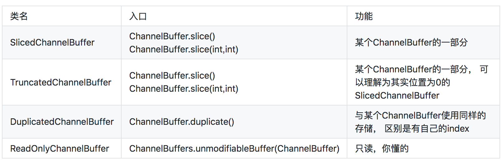

上一篇文章我们概要介绍了Netty的原理及结构，下面几篇文章我们开始对Netty的各个模块进行比较详细的分析。Netty的结构最底层是buffer机制，这部分也相对独立，我们就先从buffer讲起。

## What：buffer简介

buffer中文名又叫缓冲区，按照维基百科的解释，是"在数据传输时，在内存里开辟的一块临时保存数据的区域"。它其实是一种化同步为异步的机制，可以解决数据传输的速率不对等以及不稳定的问题。

根据这个定义，我们可以知道涉及I/O(特别是I/O写)的地方，基本会有Buffer了。就Java来说，我们非常熟悉的Old I/O--`InputStream`&`OutputStream`系列API，基本都是在内部使用到了buffer。Java课程老师就教过，必须调用`OutputStream.flush()`，才能保证数据写入生效！


而NIO中则直接将buffer这个概念封装成了对象，其中最常用的大概是ByteBuffer了。于是使用方式变为了：将数据写入Buffer，flip()一下，然后将数据读出来。于是，buffer的概念更加深入人心了！

Netty中的buffer也不例外。不同的是，Netty的buffer专为网络通讯而生，所以它又叫ChannelBuffer(好吧其实没有什么因果关系…)。我们下面就来讲讲Netty中得buffer。当然，关于Netty，我们必须讲讲它的所谓"Zero-Copy-Capable"机制。

## TCP/IP协议与buffer

TCP/IP协议是目前的主流网络协议。它是一个多层协议，最下层是物理层，最上层是应用层(HTTP协议等)，而做Java应用开发，一般只接触TCP以上，即传输层和应用层的内容。这也是Netty的主要应用场景。

TCP报文有个比较大的特点，就是它传输的时候，会先把应用层的数据项拆开成字节，然后按照自己的传输需要，选择合适数量的字节进行传输。什么叫"自己的传输需要"？首先TCP包有最大长度限制，那么太大的数据项肯定是要拆开的。其次因为TCP以及下层协议会附加一些协议头信息，如果数据项太小，那么可能报文大部分都是没有价值的头信息，这样传输是很不划算的。因此有了收集一定数量的小数据，并打包传输的Nagle算法(这个东东在HTTP协议里会很讨厌，Netty里可以用setOption("tcpNoDelay", true)关掉它)。

这么说可能太学院派了一点，我们举个例子吧：

发送时，我们这样分3次写入('|'表示两个buffer的分隔):

	   +-----+-----+-----+
	   | ABC | DEF | GHI |
	   +-----+-----+-----+

接收时，可能变成了这样:

	   +----+-------+---+---+
	   | AB | CDEFG | H | I |
	   +----+-------+---+---+

很好懂吧？可是，说了这么多，跟buffer有个什么关系呢？别急，我们来看下面一部分。

## Buffer中的分层思想

我们先回到之前的`messageReceived`方法：

```java
    public void messageReceived(
            ChannelHandlerContext ctx, MessageEvent e) {
        // Send back the received message to the remote peer.
        transferredBytes.addAndGet(((ChannelBuffer) e.getMessage()).readableBytes());
        e.getChannel().write(e.getMessage());
    }
```
    
这里`MessageEvent.getMessage()`默认的返回值是一个`ChannelBuffer`。我们知道，业务中需要的"Message"，其实是一条应用层级别的完整消息，而一般的buffer工作在传输层，与"Message"是不能对应上的。那么这个ChannelBuffer是什么呢？

来一个官方给的图，我想这个答案就很明显了：

![virtual buffer in Netty][3]

这里可以看到，TCP层HTTP报文被分成了两个ChannelBuffer，这两个Buffer对我们上层的逻辑(HTTP处理)是没有意义的。但是两个ChannelBuffer被组合起来，就成为了一个有意义的HTTP报文，这个报文对应的ChannelBuffer，才是能称之为"Message"的东西。这里用到了一个词"Virtual Buffer"，也就是所谓的"Zero-Copy-Capable Byte Buffer"了。顿时觉得豁然开朗了有没有！

我这里总结一下，**如果说NIO的Buffer和Netty的ChannelBuffer最大的区别的话，就是前者仅仅是传输上的Buffer，而后者其实是传输Buffer和抽象后的逻辑Buffer的结合。**延伸开来说，NIO仅仅是一个网络传输框架，而Netty是一个网络应用框架，包括网络以及应用的分层结构。

当然，在Netty里，默认使用`ChannelBuffer`表示"Message"，不失为一个比较实用的方法，但是`MessageEvent.getMessage()`是可以存放一个POJO的，这样子抽象程度又高了一些，这个我们在以后讲到`ChannelPipeline`的时候会说到。

## Netty中的ChannelBuffer及实现

好了，终于来到了代码实现部分。之所以啰嗦了这么多，因为我觉得，关于"Zero-Copy-Capable Rich Byte Buffer"，理解为什么需要它，比理解它是怎么实现的，可能要更重要一点。

我想可能很多朋友跟我一样，喜欢"顺藤摸瓜"式读代码--找到一个入口，然后顺着查看它的调用，直到理解清楚。很幸运，`ChannelBuffers`(注意有s!)就是这样一根"藤"，它是所有ChannelBuffer实现类的入口，它提供了很多静态的工具方法来创建不同的Buffer，靠“顺藤摸瓜”式读代码方式，大致能把各种ChannelBuffer的实现类摸个遍。先列一下ChannelBuffer相关类图。

![channel buffer in Netty][1]

此外还有`WrappedChannelBuffer`系列也是继承自`AbstractChannelBuffer`，图放到了后面。

### ChannelBuffer中的readerIndex和writerIndex

开始以为Netty的ChannelBuffer是对NIO ByteBuffer的一个封装，其实不是的，**它是把ByteBuffer重新实现了一遍**。

以最常用的`HeapChannelBuffer`为例，其底层也是一个byte[]，与ByteBuffer不同的是，它是可以同时进行读和写的，而不需要使用flip()进行读写切换。ChannelBuffer读写的核心代码在`AbstactChannelBuffer`里，这里通过readerIndex和writerIndex两个整数，分别指向当前读的位置和当前写的位置，并且，readerIndex总是小于writerIndex的。贴两段代码，让大家能看的更明白一点：

```java
    public void writeByte(int value) {
        setByte(writerIndex ++, value);
    }

    public byte readByte() {
        if (readerIndex == writerIndex) {
            throw new IndexOutOfBoundsException("Readable byte limit exceeded: "
                    + readerIndex);
        }
        return getByte(readerIndex ++);
    }

    public int writableBytes() {
        return capacity() - writerIndex;
    }
    
    public int readableBytes() {
        return writerIndex - readerIndex;
    }
```

我倒是觉得这样的方式非常自然，比单指针与flip()要更加好理解一些。AbstactChannelBuffer还有两个相应的mark指针`markedReaderIndex`和`markedWriterIndex`，跟NIO的原理是一样的，这里不再赘述了。

### 字节序Endianness与HeapChannelBuffer

在创建Buffer时，我们注意到了这样一个方法：`public static ChannelBuffer buffer(ByteOrder endianness, int capacity);`，其中`ByteOrder`是什么意思呢？

这里有个很基础的概念：字节序(ByteOrder/Endianness)。它规定了多余一个字节的数字(int啊long什么的)，如何在内存中表示。BIG_ENDIAN(大端序)表示高位在前，整型数`12`会被存储为`0 0 0 12`四字节，而LITTLE_ENDIAN则正好相反。可能搞C/C++的程序员对这个会比较熟悉，而Javaer则比较陌生一点，因为Java已经把内存给管理好了。但是在网络编程方面，根据协议的不同，不同的字节序也可能会被用到。目前大部分协议还是采用大端序，可参考[RFC1700](http://tools.ietf.org/html/rfc1700)。

了解了这些知识，我们也很容易就知道为什么会有`BigEndianHeapChannelBuffer`和`LittleEndianHeapChannelBuffer`了！

### DynamicChannelBuffer

DynamicChannelBuffer是一个很方便的Buffer，之所以叫Dynamic是因为它的长度会根据内容的长度来扩充，你可以像使用ArrayList一样，无须关心其容量。实现自动扩容的核心在于`ensureWritableBytes`方法，算法很简单：在写入前做容量检查，容量不够时，新建一个容量x2的buffer，跟ArrayList的扩容是相同的。贴一段代码吧(为了代码易懂，这里我删掉了一些边界检查，只保留主逻辑)：

```java
    public void writeByte(int value) {
        ensureWritableBytes(1);
        super.writeByte(value);
    }

    public void ensureWritableBytes(int minWritableBytes) {
        if (minWritableBytes <= writableBytes()) {
            return;
        }

        int newCapacity = capacity();
        int minNewCapacity = writerIndex() + minWritableBytes;
        while (newCapacity < minNewCapacity) {
            newCapacity <<= 1;
        }

        ChannelBuffer newBuffer = factory().getBuffer(order(), newCapacity);
        newBuffer.writeBytes(buffer, 0, writerIndex());
        buffer = newBuffer;
    }
```

### CompositeChannelBuffer

`CompositeChannelBuffer`是由多个ChannelBuffer组合而成的，可以看做一个整体进行读写。这里有一个技巧：CompositeChannelBuffer并不会开辟新的内存并直接复制所有ChannelBuffer内容，而是直接保存了所有ChannelBuffer的引用，并在子ChannelBuffer里进行读写，从而实现了"Zero-Copy-Capable"了。来段简略版的代码吧：

```java
	public class CompositeChannelBuffer{

	    //components保存所有内部ChannelBuffer
	    private ChannelBuffer[] components;
	    //indices记录在整个CompositeChannelBuffer中，每个components的起始位置
	    private int[] indices;
	    //缓存上一次读写的componentId
	    private int lastAccessedComponentId;

	    public byte getByte(int index) {
	        //通过indices中记录的位置索引到对应第几个子Buffer
	        int componentId = componentId(index);
	        return components[componentId].getByte(index - indices[componentId]);
	    }

	    public void setByte(int index, int value) {
	        int componentId = componentId(index);
	        components[componentId].setByte(index - indices[componentId], value);
	    }

	}		
```

查找componentId的算法再次不作介绍了，大家自己实现起来也不会太难。值得一提的是，基于ChannelBuffer连续读写的特性，使用了顺序查找(而不是二分查找)，并且用`lastAccessedComponentId`来进行缓存。

### ByteBufferBackedChannelBuffer

前面说ChannelBuffer是自己的实现的，其实只说对了一半。`ByteBufferBackedChannelBuffer`就是封装了NIO ByteBuffer的类，用于实现堆外内存的Buffer(使用NIO的`DirectByteBuffer`)。当然，其实它也可以放其他的ByteBuffer的实现类。代码实现就不说了，也没啥可说的。

### WrappedChannelBuffer

![virtual buffer in Netty][2]

`WrappedChannelBuffer`都是几个对已有ChannelBuffer进行包装，完成特定功能的类。代码不贴了，实现都比较简单，列一下功能吧。




可以看到，关于实现方面，Netty 3.7的buffer相关内容还是比较简单的，也没有太多费脑细胞的地方。

而Netty 4.0之后就不同了。4.0，ChannelBuffer改名ByteBuf，成了单独项目buffer，并且为了性能优化，加入了BufferPool之类的机制，已经变得比较复杂了(本质倒没怎么变)。性能优化是个很复杂的事情，研究源码时，建议先避开这些东西，除非你对算法情有独钟。举个例子，Netty4.0里为了优化，将Map换成了Java 8里6000行的[ConcurrentHashMapV8](https://github.com/netty/netty/blob/master/common/src/main/java/io/netty/util/internal/chmv8/ConcurrentHashMapV8.java)，你们感受一下…

  [1]: http://static.oschina.net/uploads/space/2013/0925/081551_v8pK_190591.png
  [2]: http://static.oschina.net/uploads/space/2013/0925/074748_oSkl_190591.png
  [3]: http://static.oschina.net/uploads/space/2013/0925/225747_kDAk_190591.png
  

参考资料：

* TCP/IP协议 [http://zh.wikipedia.org/zh-cn/TCP/IP%E5%8D%8F%E8%AE%AE](http://zh.wikipedia.org/zh-cn/TCP/IP%E5%8D%8F%E8%AE%AE)
* Data_buffer [http://en.wikipedia.org/wiki/Data_buffer](http://en.wikipedia.org/wiki/Data_buffer)
* Endianness [http://en.wikipedia.org/wiki/Endianness](http://en.wikipedia.org/wiki/Endianness)
