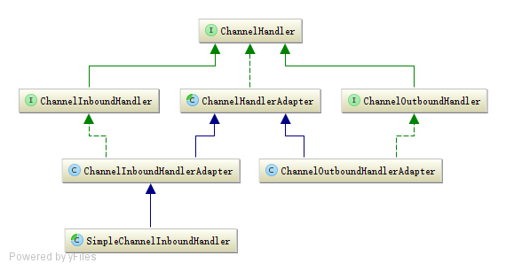

ChannelHandler并不处理事件，而由其子类代为处理：ChannelInboundHandler拦截和处理入站事件，ChannelOutboundHandler拦截和处理出站事件。ChannelHandler和ChannelHandlerContext通过组合或继承的方式关联到一起成对使用。事件通过ChannelHandlerContext主动调用如fireXXX()和write(msg)等方法，将事件传播到下一个处理器。注意：入站事件在ChannelPipeline双向链表中由头到尾正向传播，出站事件则方向相反。
当客户端连接到服务器时，Netty新建一个ChannelPipeline处理其中的事件，而一个ChannelPipeline中含有若干ChannelHandler。如果每个客户端连接都新建一个ChannelHandler实例，当有大量客户端时，服务器将保存大量的ChannelHandler实例。为此，Netty提供了Sharable注解，如果一个ChannelHandler状态无关，那么可将其标注为Sharable，如此，服务器只需保存一个实例就能处理所有客户端的事件。

## 核心类图


上图是ChannelHandler的核心类类图，其继承层次清晰，我们逐一分析。

### 1.ChannelHandler


ChannaleHandler 作为最顶层的接口，并不处理入站和出站事件，所以接口中只包含最基本的方法：
```
// Handler本身被添加到ChannelPipeline时调用
    void handlerAdded(ChannelHandlerContext ctx) throws Exception;
    // Handler本身被从ChannelPipeline中删除时调用
    void handlerRemoved(ChannelHandlerContext ctx) throws Exception;
    // 发生异常时调用
    void exceptionCaught(ChannelHandlerContext ctx, Throwable cause) throws Exception;
```
其中也定义了Sharable标记注解：
```
 @Inherited
    @Documented
    @Target(ElementType.TYPE)
    @Retention(RetentionPolicy.RUNTIME)
    @interface Sharable {
        // no value
    }
```
作为ChannelHandler的默认实现，ChannelHandlerAdapter有个重要的方法isSharable()，代码如下：

```
 public boolean isSharable() {
        Class<?> clazz = getClass();
        // 每个线程一个缓存
        Map<Class<?>, Boolean> cache = 
                InternalThreadLocalMap.get().handlerSharableCache();
        Boolean sharable = cache.get(clazz);
        if (sharable == null) {
            // Handler是否存在Sharable注解
            sharable = clazz.isAnnotationPresent(Sharable.class);
            cache.put(clazz, sharable);
        }
        return sharable;
    }
```

这里引入了优化的线程局部变量InternalThreadLocalMap，将在以后分析，此处可简单理解为线程变量ThreadLocal，即每个线程都有一份ChannelHandler是否Sharable的缓存。这样可以减少线程间的竞争，提升性能。

### 2.ChannelInboundHandler

ChannelInboundHandler处理入站事件，以及用户自定义事件：
```
    // 类似的入站事件
    void channeXXX(ChannelHandlerContext ctx) throws Exception;
    // 用户自定义事件
    void userEventTriggered(ChannelHandlerContext ctx, Object evt) throws Exception;
```
ChannelInboundHandlerAdapter作为ChannelInboundHandler的实现，默认将入站事件自动传播到下一个入站处理器。其中的代码高度一致，如下：
```
    public void channelRead(ChannelHandlerContext ctx, Object msg) throws Exception {
        ctx.fireChannelRead(msg);
    }
```
### 3.ChannelOutboundHandler

ChannelOutboundHandler处理出站事件：
```
// 类似的出站事件
    void read(ChannelHandlerContext ctx) throws Exception;
```
同理，ChannelOutboundHandlerAdapter作为ChannelOutboundHandler的事件，默认将出站事件传播到下一个出站处理器：
```
    @Override
    public void read(ChannelHandlerContext ctx) throws Exception {
        ctx.read();
    }
```

### 4.ChannelDuplexHandler
ChannelDuplexHandler则同时实现了ChannelInboundHandler和ChannelOutboundHandler接口。如果一个所需的ChannelHandler既要处理入站事件又要处理出站事件，推荐继承此类。
至此，ChannelHandler的核心类已分析完毕，接下来将分析一些Netty自带的Handler。
