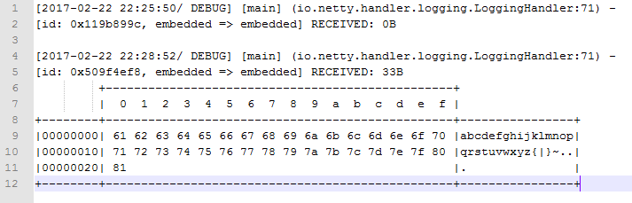

## LoggingHandler

日志处理器LoggingHandler是使用Netty进行开发时的好帮手，它可以对入站\出站事件进行日志记录，从而方便我们进行问题排查。首先看类签名：
```
    @Sharable
    public class LoggingHandler extends ChannelDuplexHandler
```
注解Sharable说明LoggingHandler没有状态相关变量，所有Channel可以使用一个实例。继承自ChannelDuplexHandler表示对入站出站事件都进行日志记录。最佳实践：使用static修饰LoggingHandler实例，并在生产环境删除LoggingHandler。
该类的成员变量如下：

```
 // 实际使用的日志处理，slf4j、log4j等
    protected final InternalLogger logger;
    // 日志框架使用的日志级别
    protected final InternalLogLevel internalLevel;
    // Netty使用的日志级别
    private final LogLevel level;
    
    // 默认级别为Debug
    private static final LogLevel DEFAULT_LEVEL = LogLevel.DEBUG;
```


看完成员变量，在移目构造方法，LoggingHandler的构造方法较多，一个典型的如下：

```
  public LoggingHandler(LogLevel level) {
        if (level == null) {
            throw new NullPointerException("level");
        }
        // 获得实际的日志框架
        logger = InternalLoggerFactory.getInstance(getClass());
        // 设置日志级别
        this.level = level;
        internalLevel = level.toInternalLevel();
    }
```

在构造方法中获取用户实际使用的日志框架，如slf4j、log4j等，并日志设置记录级别。其他的构造方法也类似，不在赘述。
记录出站、入站事件的过程类似，我们以ChannelRead()为例分析，代码如下：

```
 public void channelRead(ChannelHandlerContext ctx, Object msg) throws Exception {
        logMessage(ctx, "RECEIVED", msg);   // 记录日志
        ctx.fireChannelRead(msg);   // 传播事件
    }
    
    private void logMessage(ChannelHandlerContext ctx, String eventName, Object msg) {
        if (logger.isEnabled(internalLevel)) {
            logger.log(internalLevel, format(ctx, formatMessage(eventName, msg)));
        }
    }
    
    protected String formatMessage(String eventName, Object msg) {
        if (msg instanceof ByteBuf) {
            return formatByteBuf(eventName, (ByteBuf) msg);
        } else if (msg instanceof ByteBufHolder) {
            return formatByteBufHolder(eventName, (ByteBufHolder) msg);
        } else {
            return formatNonByteBuf(eventName, msg);
        }
    }
```

其中的代码都简单明了，主要分析formatByteBuf()方法：

```
 protected String formatByteBuf(String eventName, ByteBuf msg) {
        int length = msg.readableBytes();
        if (length == 0) {
            StringBuilder buf = new StringBuilder(eventName.length() + 4);
            buf.append(eventName).append(": 0B");
            return buf.toString();
        } else {
            int rows = length / 16 + (length % 15 == 0? 0 : 1) + 4;
            StringBuilder buf = new StringBuilder(eventName.length() + 
                        2 + 10 + 1 + 2 + rows * 80);

            buf.append(eventName)
                      .append(": ").append(length).append('B').append(NEWLINE);
            appendPrettyHexDump(buf, msg);

            return buf.toString();
        }
```

其中的数字计算，容易让人失去耐心，使用逆向思维，放上结果反推：



