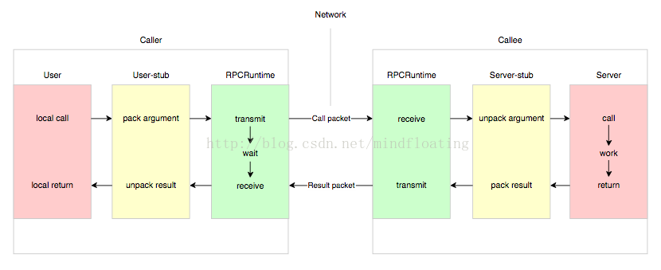
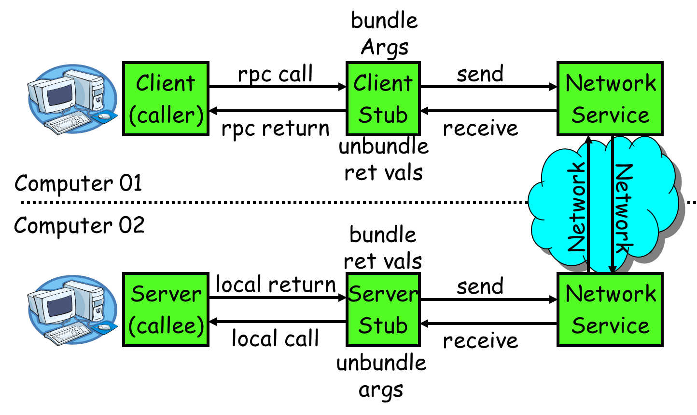
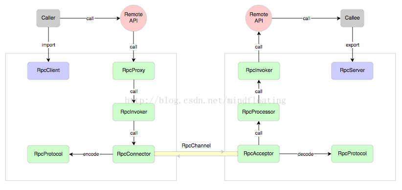

本文来自：csdn博客，作者在其中做了一些补充并添加了示例

Nelson 的论文中指出实现 RPC 的程序包括 5 个部分：

1. User

2. User-stub

3. RPCRuntime

4. Server-stub

5. Server

这 5 个部分的关系如下图所示




这里 user 就是 client 端，当 user 想发起一个远程调用时，它实际是通过本地调用user-stub。user-stub 负责将调用的接口、方法和参数通过约定的协议规范进行编码并通过本地的 RPCRuntime 实例传输到远端的实例。远端 RPCRuntime 实例收到请求后交给 server-stub 进行解码后发起本地端调用，调用结果再返回给 user 端。



粗粒度的 RPC 实现概念结构，这里我们进一步细化它应该由哪些组件构成，如下图所示。



RPC 服务方通过 RpcServer 去导出（export）远程接口方法，而客户方通过 RpcClient 去引入（import）远程接口方法。客户方像调用本地方法一样去调用远程接口方法，RPC 框架提供接口的代理实现，实际的调用将委托给代理RpcProxy 。代理封装调用信息并将调用转交给RpcInvoker 去实际执行。在客户端的RpcInvoker 通过连接器RpcConnector 去维持与服务端的通道RpcChannel，并使用RpcProtocol 执行协议编码（encode）并将编码后的请求消息通过通道发送给服务方。

RPC 服务端接收器 RpcAcceptor 接收客户端的调用请求，同样使用RpcProtocol 执行协议解码（decode）。解码后的调用信息传递给RpcProcessor 去控制处理调用过程，最后再委托调用给RpcInvoker 去实际执行并返回调用结果。如下是各个部分的详细职责：

    1. RpcServer  

       负责导出（export）远程接口  

    2. RpcClient  

       负责导入（import）远程接口的代理实现  

    3. RpcProxy  

       远程接口的代理实现  

    4. RpcInvoker  

       客户方实现：负责编码调用信息和发送调用请求到服务方并等待调用结果返回  

       服务方实现：负责调用服务端接口的具体实现并返回调用结果  

    5. RpcProtocol  

       负责协议编/解码  

    6. RpcConnector  

       负责维持客户方和服务方的连接通道和发送数据到服务方  

    7. RpcAcceptor  

       负责接收客户方请求并返回请求结果  

    8. RpcProcessor  

       负责在服务方控制调用过程，包括管理调用线程池、超时时间等  

    9. RpcChannel  

       数据传输通道  

### Java中常用的RPC框架

目前常用的RPC框架如下：

1. Thrift：thrift是一个软件框架，用来进行可扩展且跨语言的服务的开发。它结合了功能强大的软件堆栈和代码生成引擎，以构建在 C++, Java, Python, PHP, Ruby, Erlang, Perl, Haskell, C#, Cocoa, JavaScript, Node.js, Smalltalk, and OCaml 这些编程语言间无缝结合的、高效的服务。

2. Dubbo：Dubbo是一个分布式服务框架，以及SOA治理方案。其功能主要包括：高性能NIO通讯及多协议集成，服务动态寻址与路由，软负载均衡与容错，依赖分析与降级等。 Dubbo是阿里巴巴内部的SOA服务化治理方案的核心框架，Dubbo自2011年开源后，已被许多非阿里系公司使用。 

3. Spring Cloud：Spring Cloud由众多子项目组成，如Spring Cloud Config、Spring Cloud Netflix、Spring Cloud Consul 等，提供了搭建分布式系统及微服务常用的工具，如配置管理、服务发现、断路器、智能路由、微代理、控制总线、一次性token、全局锁、选主、分布式会话和集群状态等，满足了构建微服务所需的所有解决方案。Spring Cloud基于Spring Boot, 使得开发部署极其简单。

### RPC和消息队列的差异

#### 1. 功能差异

在架构上，RPC和Message的差异点是，Message有一个中间结点Message Queue，可以把消息存储。
消息的特点
1. Message Queue把请求的压力保存一下，逐渐释放出来，让处理者按照自己的节奏来处理。
2. Message Queue引入一下新的结点，系统的可靠性会受Message Queue结点的影响。
3. Message Queue是异步单向的消息。发送消息设计成是不需要等待消息处理的完成。
所以对于有同步返回需求，用Message Queue则变得麻烦了。
RPC的特点
同步调用，对于要等待返回结果/处理结果的场景，RPC是可以非常自然直觉的使用方式(RPC也可以是异步调用)。
由于等待结果，Consumer（Client）会有线程消耗。如果以异步RPC的方式使用，Consumer（Client）线程消耗可以去掉。但不能做到像消息一样暂存消息/请求，压力会直接传导到服务Provider。
#### 2. 适用场合差异
1. 希望同步得到结果的场合，RPC合适。
2. 希望使用简单，则RPC；RPC操作基于接口，使用简单，使用方式模拟本地调用。异步的方式编程比较复杂。
3. 不希望发送端（RPC Consumer、Message Sender）受限于处理端（RPC Provider、Message Receiver）的速度时，使用Message Queue。
随着业务增长，有的处理端处理量会成为瓶颈，会进行同步调用到异步消息的改造。这样的改造实际上有调整业务的使用方式。比如原来一个操作页面提交后就下一个页面会看到处理结果；改造后异步消息后，下一个页面就会变成“操作已提交，完成后会得到通知”。
#### 3. 不适用场合说明
1. RPC同步调用使用Message Queue来传输调用信息。 上面分析可以知道，这样的做法，发送端是在等待，同时占用一个中间点的资源。变得复杂了，但没有对等的收益。
2. 对于返回值是void的调用，可以这样做，因为实际上这个调用业务上往往不需要同步得到处理结果的，只要保证会处理即可。（RPC的方式可以保证调用返回即处理完成，使用消息方式后这一点不能保证了。）
3. 返回值是void的调用，使用消息，效果上是把消息的使用方式Wrap成了服务调用（服务调用使用方式成简单，基于业务接口）。

### RPC框架的核心技术点

RPC框架实现的几个核心技术点：

（1）服务暴露：

远程提供者需要以某种形式提供服务调用相关的信息，包括但不限于服务接口定义、数据结构、或者中间态的服务定义文件。例如Facebook的Thrift的IDL文件，Web service的WSDL文件；服务的调用者需要通过一定的途径获取远程服务调用相关的信息。

目前，大部分跨语言平台 RPC 框架采用根据 IDL 定义通过 code generator 去生成 stub 代码，这种方式下实际导入的过程就是通过代码生成器在编译期完成的。代码生成的方式对跨语言平台 RPC 框架而言是必然的选择，而对于同一语言平台的 RPC 则可以通过共享接口定义来实现。这里的导入方式本质也是一种代码生成技术，只不过是在运行时生成，比静态编译期的代码生成看起来更简洁些。

java 中还有一种比较特殊的调用就是多态，也就是一个接口可能有多个实现，那么远程调用时到底调用哪个？这个本地调用的语义是通过 jvm 提供的引用多态性隐式实现的，那么对于 RPC 来说跨进程的调用就没法隐式实现了。如果前面DemoService 接口有 2 个实现，那么在导出接口时就需要特殊标记不同的实现需要，那么远程调用时也需要传递该标记才能调用到正确的实现类，这样就解决了多态调用的语义问题。

（2）远程代理对象：

服务调用者用的服务实际是远程服务的本地代理。说白了就是通过动态代理来实现。

java 里至少提供了两种技术来提供动态代码生成，一种是 jdk 动态代理，另外一种是字节码生成。动态代理相比字节码生成使用起来更方便，但动态代理方式在性能上是要逊色于直接的字节码生成的，而字节码生成在代码可读性上要差很多。两者权衡起来，个人认为牺牲一些性能来获得代码可读性和可维护性显得更重要。

（3）通信：

RPC框架与具体的协议无关。RPC 可基于 HTTP 或 TCP 协议，Web Service 就是基于 HTTP 协议的 RPC，它具有良好的跨平台性，但其性能却不如基于 TCP 协议的 RPC。

1. TCP/HTTP：众所周知，TCP 是传输层协议，HTTP 是应用层协议，而传输层较应用层更加底层，在数据传输方面，越底层越快，因此，在一般情况下，TCP 一定比 HTTP 快。

2. 消息ID：RPC 的应用场景实质是一种可靠的请求应答消息流，和 HTTP 类似。因此选择长连接方式的 TCP 协议会更高效，与 HTTP 不同的是在协议层面我们定义了每个消息的唯一 id，因此可以更容易的复用连接。

3. IO方式：为了支持高并发，传统的阻塞式 IO 显然不太合适，因此我们需要异步的 IO，即 NIO。Java 提供了 NIO 的解决方案，Java 7 也提供了更优秀的 NIO.2 支持。

4. 多连接：既然使用长连接，那么第一个问题是到底 client 和 server 之间需要多少根连接？实际上单连接和多连接在使用上没有区别，对于数据传输量较小的应用类型，单连接基本足够。单连接和多连接最大的区别在于，每根连接都有自己私有的发送和接收缓冲区，因此大数据量传输时分散在不同的连接缓冲区会得到更好的吞吐效率。所以，如果你的数据传输量不足以让单连接的缓冲区一直处于饱和状态的话，那么使用多连接并不会产生任何明显的提升，反而会增加连接管理的开销。
5. 心跳：连接是由 client 端发起建立并维持。如果 client 和 server 之间是直连的，那么连接一般不会中断（当然物理链路故障除外）。如果 client 和 server 连接经过一些负载中转设备，有可能连接一段时间不活跃时会被这些中间设备中断。为了保持连接有必要定时为每个连接发送心跳数据以维持连接不中断。心跳消息是 RPC 框架库使用的内部消息，在前文协议头结构中也有一个专门的心跳位，就是用来标记心跳消息的，它对业务应用透明。

（4）序列化：

两方面会直接影响 RPC 的性能，一是传输方式，二是序列化。

1. 序列化方式：毕竟是远程通信，需要将对象转化成二进制流进行传输。不同的RPC框架应用的场景不同，在序列化上也会采取不同的技术。 就序列化而言，Java 提供了默认的序列化方式，但在高并发的情况下，这种方式将会带来一些性能上的瓶颈，于是市面上出现了一系列优秀的序列化框架，比如：Protobuf、Kryo、Hessian、Jackson 等，它们可以取代 Java 默认的序列化，从而提供更高效的性能。

2. 编码内容：出于效率考虑，编码的信息越少越好（传输数据少），编码的规则越简单越好（执行效率高）。如下是编码需具备的信息：

```
-- 调用编码 --  
1. 接口方法  
   包括接口名、方法名  
2. 方法参数  
   包括参数类型、参数值  
3. 调用属性  
   包括调用属性信息，例如调用附件隐式参数、调用超时时间等  
  
-- 返回编码 --  
1. 返回结果  
   接口方法中定义的返回值  
2. 返回码  
   异常返回码  
3. 返回异常信息  
   调用异常信息

```

除了以上这些必须的调用信息，我们可能还需要一些元信息以方便程序编解码以及未来可能的扩展。这样我们的编码消息里面就分成了两部分，一部分是元信息、另一部分是调用的必要信息。如果设计一种 RPC 协议消息的话，元信息我们把它放在协议消息头中，而必要信息放在协议消息体中。下面给出一种概念上的 RPC 协议消息设计格式：

```
-- 消息头 --  
magic      : 协议魔数，为解码设计  
header size: 协议头长度，为扩展设计  
version    : 协议版本，为兼容设计  
st         : 消息体序列化类型  
hb         : 心跳消息标记，为长连接传输层心跳设计  
ow         : 单向消息标记，  
rp         : 响应消息标记，不置位默认是请求消息  
status code: 响应消息状态码  
reserved   : 为字节对齐保留  
message id : 消息 id  
body size  : 消息体长度  
  
-- 消息体 --  
采用序列化编码，常见有以下格式  
xml   : 如 webservie soap  
json  : 如 JSON-RPC  
binary: 如 thrift; hession; kryo 等

```

### RPC框架简易实现及其实例分析

(1).服务端

　　服务端提供客户端所期待的服务，一般包括三个部分：服务接口，服务实现以及服务的注册暴露三部分，如下：服务接口
  ```
  public interface HelloService {
    String hello(String name);
    String hi(String msg);
}
```

服务实现

```
public class HelloServiceImpl implements HelloService{
    @Override
    public String hello(String name) {
        return "Hello " + name;
    }
 
    @Override
    public String hi(String msg) {
        return "Hi, " + msg;
    }
}

```

服务暴露：只有把服务暴露出来，才能让客户端进行调用，这是RPC框架功能之一。

```
public class RpcProvider {
    public static void main(String[] args) throws Exception {
        HelloService service = new HelloServiceImpl();
        // RPC框架将服务暴露出来，供客户端消费
        RpcFramework.export(service, 1234);
    }
}

```

(2).客户端

　　客户端消费服务端所提供的服务，一般包括两个部分：服务接口和服务引用两个部分，如下：服务接口：与服务端共享同一个服务接口
  ```
  public interface HelloService {
    String hello(String name);
    String hi(String msg);
}
```

服务引用：消费端通过RPC框架进行远程调用，这也是RPC框架功能之一

```

public class RpcConsumer {
    public static void main(String[] args) throws Exception {
        // 由RpcFramework生成的HelloService的代理
        HelloService service = RpcFramework.refer(HelloService.class, "127.0.0.1", 1234);
        String hello = service.hello("World");
        System.out.println("客户端收到远程调用的结果 ： " + hello);
    }
}

```

(3).RPC框架原型实现

　　RPC框架主要包括两大功能：一个用于服务端暴露服务，一个用于客户端引用服务。服务端暴露服务

```
    /**
     * 暴露服务
     *
     * @param service 服务实现
     * @param port    服务端口
     * @throws Exception
     */
    public static void export(final Object service, int port) throws Exception {
        if (service == null) {
            throw new IllegalArgumentException("service instance == null");
        }
        if (port <= 0 || port > 65535) {
            throw new IllegalArgumentException("Invalid port " + port);
        }
        System.out.println("Export service " + service.getClass().getName() + " on port " + port);
        // 建立Socket服务端
        ServerSocket server = new ServerSocket(port);
        for (; ; ) {
            try {
                // 监听Socket请求
                final Socket socket = server.accept();
                new Thread(new Runnable() {
                    @Override
                    public void run() {
                        try {
                            try {
                                /* 获取请求流，Server解析并获取请求*/
                                // 构建对象输入流，从源中读取对象到程序中
                                ObjectInputStream input = new ObjectInputStream(
                                    socket.getInputStream());
                                try {
 
                                    System.out.println("\nServer解析请求 ： ");
                                    String methodName = input.readUTF();
                                    System.out.println("methodName : " + methodName);
                                    // 泛型与数组是不兼容的，除了通配符作泛型参数以外
                                    Class<?>[] parameterTypes = (Class<?>[])input.readObject();
                                    System.out.println(
                                        "parameterTypes : " + Arrays.toString(parameterTypes));
                                    Object[] arguments = (Object[])input.readObject();
                                    System.out.println("arguments : " + Arrays.toString(arguments));
 
 
                                    /* Server 处理请求，进行响应*/
                                    ObjectOutputStream output = new ObjectOutputStream(
                                        socket.getOutputStream());
                                    try {
                                        // service类型为Object的(可以发布任何服务)，故只能通过反射调用处理请求
                                        // 反射调用，处理请求
                                        Method method = service.getClass().getMethod(methodName,
                                            parameterTypes);
                                        Object result = method.invoke(service, arguments);
                                        System.out.println("\nServer 处理并生成响应 ：");
                                        System.out.println("result : " + result);
                                        output.writeObject(result);
                                    } catch (Throwable t) {
                                        output.writeObject(t);
                                    } finally {
                                        output.close();
                                    }
                                } finally {
                                    input.close();
                                }
                            } finally {
                                socket.close();
                            }
                        } catch (Exception e) {
                            e.printStackTrace();
                        }
                    }
                }).start();
            } catch (Exception e) {
                e.printStackTrace();
            }
        }
    }

```
从该RPC框架的简易实现来看，RPC服务端逻辑是：首先创建ServerSocket负责监听特定端口并接收客户连接请求，然后使用Java原生的序列化/反序列化机制来解析得到请求，包括所调用方法的名称、参数列表和实参，最后反射调用服务端对服务接口的具体实现并将得到的结果回传至客户端。至此，一次简单PRC调用的服务端流程执行完毕。客户端引用服务

```
    /**
     * 引用服务
     *
     * @param <T>            接口泛型
     * @param interfaceClass 接口类型
     * @param host           服务器主机名
     * @param port           服务器端口
     * @return 远程服务，返回代理对象
     * @throws Exception
     */
    @SuppressWarnings("unchecked")
    public static <T> T refer(final Class<T> interfaceClass, final String host, final int port)
        throws Exception {
        if (interfaceClass == null) {
            throw new IllegalArgumentException("Interface class == null");
        }
        // JDK 动态代理的约束，只能实现对接口的代理
        if (!interfaceClass.isInterface()) {
            throw new IllegalArgumentException(
                "The " + interfaceClass.getName() + " must be interface class!");
        }
        if (host == null || host.length() == 0) {
            throw new IllegalArgumentException("Host == null!");
        }
        if (port <= 0 || port > 65535) {
            throw new IllegalArgumentException("Invalid port " + port);
        }
        System.out.println(
            "Get remote service " + interfaceClass.getName() + " from server " + host + ":" + port);
 
        // JDK 动态代理
        T proxy = (T)Proxy.newProxyInstance(interfaceClass.getClassLoader(),
            new Class<?>[] {interfaceClass}, new InvocationHandler() {
                // invoke方法本意是对目标方法的增强，在这里用于发送RPC请求和接收响应
                @Override
                public Object invoke(Object proxy, Method method, Object[] arguments)
                    throws Throwable {
                    // 创建Socket客户端，并与服务端建立链接
                    Socket socket = new Socket(host, port);
                    try {
                        /* 客户端像服务端进行请求，并将请求参数写入流中*/
                        // 将对象写入到对象输出流，并将其发送到Socket流中去
                        ObjectOutputStream output = new ObjectOutputStream(
                            socket.getOutputStream());
                        try {
                            // 发送请求
                            System.out.println("\nClient发送请求 ： ");
                            output.writeUTF(method.getName());
                            System.out.println("methodName : " + method.getName());
                            output.writeObject(method.getParameterTypes());
                            System.out.println("parameterTypes : " + Arrays.toString(method
                                .getParameterTypes()));
                            output.writeObject(arguments);
                            System.out.println("arguments : " + Arrays.toString(arguments));
 
 
                            /* 客户端读取并返回服务端的响应*/
                            ObjectInputStream input = new ObjectInputStream(
                                socket.getInputStream());
                            try {
                                Object result = input.readObject();
                                if (result instanceof Throwable) {
                                    throw (Throwable)result;
                                }
                                System.out.println("\nClient收到响应 ： ");
                                System.out.println("result : " + result);
                                return result;
                            } finally {
                                input.close();
                            }
                        } finally {
                            output.close();
                        }
                    } finally {
                        socket.close();
                    }
                }
            });
        return proxy;
    }

```

从该RPC框架的简易实现来看，RPC客户端逻辑是：首先创建Socket客户端并与服务端建立链接，然后使用Java原生的序列化/反序列化机制将调用请求发送给客户端，包括所调用方法的名称、参数列表将服务端的响应返回给用户即可。至此，一次简单PRC调用的客户端流程执行完毕。特别地，从代码实现来看，实现透明的PRC调用的关键就是 动态代理，这是RPC框架实现的灵魂所在。RPC原型实现

```
public class RpcFramework {
    /**
     * 暴露服务
     *
     * @param service 服务实现
     * @param port    服务端口
     * @throws Exception
     */
    public static void export(final Object service, int port) throws Exception {
        if (service == null) {
            throw new IllegalArgumentException("service instance == null");
        }
        if (port <= 0 || port > 65535) {
            throw new IllegalArgumentException("Invalid port " + port);
        }
        System.out.println("Export service " + service.getClass().getName() + " on port " + port);
        // 建立Socket服务端
        ServerSocket server = new ServerSocket(port);
        for (; ; ) {
            try {
                // 监听Socket请求
                final Socket socket = server.accept();
                new Thread(new Runnable() {
                    @Override
                    public void run() {
                        try {
                            try {
                                /* 获取请求流，Server解析并获取请求*/
                                // 构建对象输入流，从源中读取对象到程序中
                                ObjectInputStream input = new ObjectInputStream(
                                    socket.getInputStream());
                                try {
 
                                    System.out.println("\nServer解析请求 ： ");
                                    String methodName = input.readUTF();
                                    System.out.println("methodName : " + methodName);
                                    // 泛型与数组是不兼容的，除了通配符作泛型参数以外
                                    Class<?>[] parameterTypes = (Class<?>[])input.readObject();
                                    System.out.println(
                                        "parameterTypes : " + Arrays.toString(parameterTypes));
                                    Object[] arguments = (Object[])input.readObject();
                                    System.out.println("arguments : " + Arrays.toString(arguments));
 
 
                                    /* Server 处理请求，进行响应*/
                                    ObjectOutputStream output = new ObjectOutputStream(
                                        socket.getOutputStream());
                                    try {
                                        // service类型为Object的(可以发布任何服务)，故只能通过反射调用处理请求
                                        // 反射调用，处理请求
                                        Method method = service.getClass().getMethod(methodName,
                                            parameterTypes);
                                        Object result = method.invoke(service, arguments);
                                        System.out.println("\nServer 处理并生成响应 ：");
                                        System.out.println("result : " + result);
                                        output.writeObject(result);
                                    } catch (Throwable t) {
                                        output.writeObject(t);
                                    } finally {
                                        output.close();
                                    }
                                } finally {
                                    input.close();
                                }
                            } finally {
                                socket.close();
                            }
                        } catch (Exception e) {
                            e.printStackTrace();
                        }
                    }
                }).start();
            } catch (Exception e) {
                e.printStackTrace();
            }
        }
    }
 
 
    /**
     * 引用服务
     *
     * @param <T>            接口泛型
     * @param interfaceClass 接口类型
     * @param host           服务器主机名
     * @param port           服务器端口
     * @return 远程服务，返回代理对象
     * @throws Exception
     */
    @SuppressWarnings("unchecked")
    public static <T> T refer(final Class<T> interfaceClass, final String host, final int port)
        throws Exception {
        if (interfaceClass == null) {
            throw new IllegalArgumentException("Interface class == null");
        }
        // JDK 动态代理的约束，只能实现对接口的代理
        if (!interfaceClass.isInterface()) {
            throw new IllegalArgumentException(
                "The " + interfaceClass.getName() + " must be interface class!");
        }
        if (host == null || host.length() == 0) {
            throw new IllegalArgumentException("Host == null!");
        }
        if (port <= 0 || port > 65535) {
            throw new IllegalArgumentException("Invalid port " + port);
        }
        System.out.println(
            "Get remote service " + interfaceClass.getName() + " from server " + host + ":" + port);
 
        // JDK 动态代理
        T proxy = (T)Proxy.newProxyInstance(interfaceClass.getClassLoader(),
            new Class<?>[] {interfaceClass}, new InvocationHandler() {
                // invoke方法本意是对目标方法的增强，在这里用于发送RPC请求和接收响应
                @Override
                public Object invoke(Object proxy, Method method, Object[] arguments)
                    throws Throwable {
                    // 创建Socket客户端，并与服务端建立链接
                    Socket socket = new Socket(host, port);
                    try {
                        /* 客户端像服务端进行请求，并将请求参数写入流中*/
                        // 将对象写入到对象输出流，并将其发送到Socket流中去
                        ObjectOutputStream output = new ObjectOutputStream(
                            socket.getOutputStream());
                        try {
                            // 发送请求
                            System.out.println("\nClient发送请求 ： ");
                            output.writeUTF(method.getName());
                            System.out.println("methodName : " + method.getName());
                            output.writeObject(method.getParameterTypes());
                            System.out.println("parameterTypes : " + Arrays.toString(method
                                .getParameterTypes()));
                            output.writeObject(arguments);
                            System.out.println("arguments : " + Arrays.toString(arguments));
 
 
                            /* 客户端读取并返回服务端的响应*/
                            ObjectInputStream input = new ObjectInputStream(
                                socket.getInputStream());
                            try {
                                Object result = input.readObject();
                                if (result instanceof Throwable) {
                                    throw (Throwable)result;
                                }
                                System.out.println("\nClient收到响应 ： ");
                                System.out.println("result : " + result);
                                return result;
                            } finally {
                                input.close();
                            }
                        } finally {
                            output.close();
                        }
                    } finally {
                        socket.close();
                    }
                }
            });
        return proxy;
    }
}

```
以上是简易RPC框架实现的简易完整代码。


### 关于RPC框架的若干问题说明

(1).RPC框架如何做到透明化远程服务调用？

　　如何封装通信细节才能让用户像以本地调用方式调用远程服务呢？就Java而言，动态代理恰是解决之道。Java动态代理有JDK动态代理和CGLIB动态代理两种方式。尽管字节码生成方式实现的代理更为强大和高效，但代码维护不易，因此RPC框架的大部分实现还是选择JDK动态代理的方式。在上面的例子中，RPCFramework实现中的invoke方法封装了与远端服务通信的细节，消费方首先从RPCFramework获得服务提供方的接口，当执行helloService.hi(“Panda”)方法时就会调用invoke方法。

(2).如何发布自己的服务？

　　如何让别人使用我们的服务呢？难道就像我们上面的代码一样直接写死服务的IP以及端口就可以了吗？事实上，在实际生产实现中，使用人肉告知的方式是不现实的，因为实际生产中服务机器上/下线太频繁了。如果你发现一台机器提供服务不够，要再添加一台，这个时候就要告诉调用者我现在有两个IP了，你们要轮询调用来实现负载均衡；调用者咬咬牙改了，结果某天一台机器挂了，调用者发现服务有一半不可用，他又只能手动修改代码来删除挂掉那台机器的ip。这必然是相当痛苦的！

　　有没有一种方法能实现自动告知，即机器的上线/下线对调用方透明，调用者不再需要写死服务提供方地址？当然可以，生产中的RPC框架都采用的是自动告知的方式，比如，阿里内部使用的RPC框架HSF是通过ConfigServer来完成这项任务的。此外，Zookeeper也被广泛用于实现服务自动注册与发现功能。不管具体采用何种技术，他们大都采用的都是 发布/订阅模式。

(3).序列化与反序列化

　　我们知道，Java对象是无法直接在网络中进行传输的。那么，我们的RPC请求如何发给服务端，客户端又如何接收来自服务端的响应呢？答案是，在传输Java对象时，首先对其进行序列化，然后在相应的终端进行反序列化还原对象以便进行处理。事实上，序列化/反序列化技术也有很多种，比如Java的原生序列化方式、JSON、阿里的Hessian和ProtoBuff序列化等，它们在效率上存在差异，但又有各自的特点。
