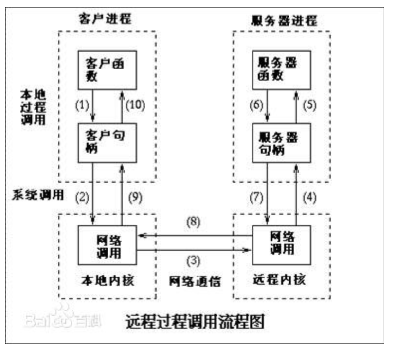

## RPC
### 1. RPC是什么

RPC（Remote Procedure Call Protocol）——远程过程调用协议，它是一种通过网络从远程计算机程序上请求服务，而不需要了解底层网络技术的协议。RPC协议假定某些传输协议的存在，如TCP或UDP，为通信程序之间携带信息数据。在OSI网络通信模型中，RPC跨越了传输层和应用层。RPC使得开发包括网络分布式多程序在内的应用程序更加容易。

RPC采用客户机/服务器模式。请求程序就是一个客户机，而服务提供程序就是一个服务器。首先，客户机调用进程发送一个有进程参数的调用信息到服务进程，然后等待应答信息。在服务器端，进程保持睡眠状态直到调用信息到达为止。当一个调用信息到达，服务器获得进程参数，计算结果，发送答复信息，然后等待下一个调用信息，最后，客户端调用进程接收答复信息，获得进程结果，然后调用执行继续进行。

### 2. 为什么要用RPC？ 
其实这是应用开发到一定的阶段的强烈需求驱动的。

1. 如果我们开发简单的单一应用，逻辑简单、用户不多、流量不大，那我们用不着；

2. 当我们的系统访问量增大、业务增多时，我们会发现一台单机运行此系统已经无法承受。此时，我们可以将业务拆分成几个互不关联的应用，分别部署在各自机器上，以划清逻辑并减小压力。此时，我们也可以不需要RPC，因为应用之间是互不关联的。

3. 当我们的业务越来越多、应用也越来越多时，自然的，我们会发现有些功能已经不能简单划分开来或者划分不出来。此时，可以将公共业务逻辑抽离出来，将之组成独立的服务Service应用 。而原有的、新增的应用都可以与那些独立的Service应用 交互，以此来完成完整的业务功能。所以此时，我们急需一种高效的应用程序之间的通讯手段来完成这种需求，所以你看，RPC大显身手的时候来了！

其实3描述的场景也是服务化 、微服务 和分布式系统架构 的基础场景。即RPC框架就是实现以上结构的有力方式。