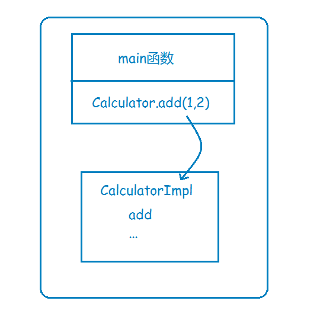
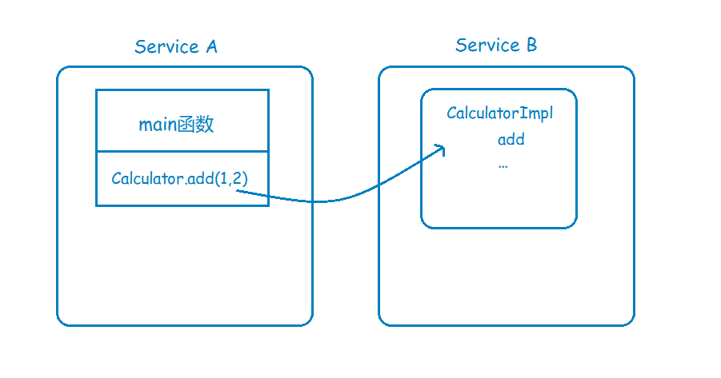
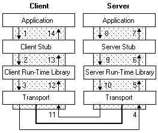

## RPC的实现原理

上面2讲我们已经讲过，RPC主要是为了解决的两个问题：
解决分布式系统中，服务之间的调用问题。
远程调用时，要能够像本地调用一样方便，让调用者感知不到远程调用的逻辑。
还是以计算器Calculator为例，如果实现类CalculatorImpl是放在本地的，那么直接调用即可：



现在系统变成分布式了，CalculatorImpl和调用方不在同一个地址空间，那么就必须要进行远程过程调用：



那么如何实现远程过程调用，也就是RPC呢，一个完整的RPC流程，可以用下面这张图来描述：




其中左边的Client，对应的就是前面的Service A，而右边的Server，对应的则是Service B。
下面一步一步详细解释一下。

* Service A的应用层代码中，调用了Calculator的一个实现类的add方法，希望执行一个加法运算；
* 这个Calculator实现类，内部并不是直接实现计算器的加减乘除逻辑，而是通过远程调用Service B的RPC接口，来获取运算结果，因此称之为Stub；
* Stub怎么和Service B建立远程通讯呢？这时候就要用到远程通讯工具了，也就是图中的Run-time Library，这个工具将帮你实现远程通讯的功能，比如Java的Socket，就是这样一个库，当然，你也可以用基于Http协议的HttpClient，或者其他通讯工具类，都可以，RPC并没有规定说你要用何种协议进行通讯；
* Stub通过调用通讯工具提供的方法，和Service B建立起了通讯，然后将请求数据发给Service B。需要注意的是，由于底层的网络通讯是基于二进制格式的，因此这里Stub传给通讯工具类的数据也必须是二进制，比如calculator.add(1,2)，你必须把参数值1和2放到一个Request对象里头（这个Request对象当然不只这些信息，还包括要调用哪个服务的哪个RPC接口等其他信息），然后序列化为二进制，再传给通讯工具类，这一点也将在下面的代码实现中体现；
* 二进制的数据传到Service B这一边了，Service B当然也有自己的通讯工具，通过这个通讯工具接收二进制的请求；
* 既然数据是二进制的，那么自然要进行反序列化了，将二进制的数据反序列化为请求对象，然后将这个请求对象交给Service B的Stub处理；
* 和之前的Service A的Stub一样，这里的Stub也同样是个“假玩意”，它所负责的，只是去解析请求对象，知道调用方要调的是哪个RPC接口，传进来的参数又是什么，然后再把这些参数传给对应的RPC接口，也就是Calculator的实际实现类去执行。很明显，如果是Java，那这里肯定用到了反射。
* RPC接口执行完毕，返回执行结果，现在轮到Service B要把数据发给Service A了，怎么发？一样的道理，一样的流程，只是现在Service B变成了Client，Service A变成了Server而已：Service B反序列化执行结果->传输给Service A->Service A反序列化执行结果 -> 将结果返回给Application，完毕。

理论的讲完了，是时候把理论变成实践了。

## 把理论变成实践

首先是Client端的应用层怎么发起RPC，ComsumerApp：

```
public class ComsumerApp {
    public static void main(String[] args) {
        Calculator calculator = new CalculatorRemoteImpl();
        int result = calculator.add(1, 2);
    }
}
```

通过一个CalculatorRemoteImpl，我们把RPC的逻辑封装进去了，客户端调用时感知不到远程调用的麻烦。下面再来看看CalculatorRemoteImpl，代码有些多，但是其实就是把上面的2、3、4几个步骤用代码实现了而已，CalculatorRemoteImpl：

```
public class CalculatorRemoteImpl implements Calculator {
    public int add(int a, int b) {
        List<String> addressList = lookupProviders("Calculator.add");
        String address = chooseTarget(addressList);
        try {
            Socket socket = new Socket(address, PORT);

            // 将请求序列化
            CalculateRpcRequest calculateRpcRequest = generateRequest(a, b);
            ObjectOutputStream objectOutputStream = new ObjectOutputStream(socket.getOutputStream());

            // 将请求发给服务提供方
            objectOutputStream.writeObject(calculateRpcRequest);

            // 将响应体反序列化
            ObjectInputStream objectInputStream = new ObjectInputStream(socket.getInputStream());
            Object response = objectInputStream.readObject();

            if (response instanceof Integer) {
                return (Integer) response;
            } else {
                throw new InternalError();
            }

        } catch (Exception e) {
            log.error("fail", e);
            throw new InternalError();
        }
    }
}
```
add方法的前面两行，lookupProviders和chooseTarget，可能大家会觉得不明觉厉。

分布式应用下，一个服务可能有多个实例，比如Service B，可能有ip地址为198.168.1.11和198.168.1.13两个实例，lookupProviders，其实就是在寻找要调用的服务的实例列表。在分布式应用下，通常会有一个服务注册中心，来提供查询实例列表的功能。

查到实例列表之后要调用哪一个实例呢，只时候就需要chooseTarget了，其实内部就是一个负载均衡策略。

由于我们这里只是想实现一个简单的RPC，所以暂时不考虑服务注册中心和负载均衡，因此代码里写死了返回ip地址为127.0.0.1。

代码继续往下走，我们这里用到了Socket来进行远程通讯，同时利用ObjectOutputStream的writeObject和ObjectInputStream的readObject，来实现序列化和反序列化。

最后再来看看Server端的实现，和Client端非常类似，ProviderApp：

```
public class ProviderApp {
    private Calculator calculator = new CalculatorImpl();

    public static void main(String[] args) throws IOException {
        new ProviderApp().run();
    }

    private void run() throws IOException {
        ServerSocket listener = new ServerSocket(9090);
        try {
            while (true) {
                Socket socket = listener.accept();
                try {
                    // 将请求反序列化
                    ObjectInputStream objectInputStream = new ObjectInputStream(socket.getInputStream());
                    Object object = objectInputStream.readObject();

                    log.info("request is {}", object);

                    // 调用服务
                    int result = 0;
                    if (object instanceof CalculateRpcRequest) {
                        CalculateRpcRequest calculateRpcRequest = (CalculateRpcRequest) object;
                        if ("add".equals(calculateRpcRequest.getMethod())) {
                            result = calculator.add(calculateRpcRequest.getA(), calculateRpcRequest.getB());
                        } else {
                            throw new UnsupportedOperationException();
                        }
                    }

                    // 返回结果
                    ObjectOutputStream objectOutputStream = new ObjectOutputStream(socket.getOutputStream());
                    objectOutputStream.writeObject(new Integer(result));
                } catch (Exception e) {
                    log.error("fail", e);
                } finally {
                    socket.close();
                }
            }
        } finally {
            listener.close();
        }
    }

}
```

Server端主要是通过ServerSocket的accept方法，来接收Client端的请求，接着就是反序列化请求->执行->序列化执行结果，最后将二进制格式的执行结果返回给Client。

就这样我们实现了一个简陋而又详细的RPC。  

说它简陋，是因为这个实现确实比较挫，在下一小节会说它为什么挫。
说它详细，是因为它一步一步的演示了一个RPC的执行流程，方便大家了解RPC的内部机制。

## 为什么说这个RPC实现很挫

这个RPC实现只是为了给大家演示一下RPC的原理，要是想放到生产环境去用，那是绝对不行的。

1、缺乏通用性
我通过给Calculator接口写了一个CalculatorRemoteImpl，来实现计算器的远程调用，下一次要是有别的接口需要远程调用，是不是又得再写对应的远程调用实现类？这肯定是很不方便的。

那该如何解决呢？先来看看使用Dubbo时是如何实现RPC调用的：

```
@Reference
private Calculator calculator;

...

calculator.add(1,2);

...

```

Dubbo通过和Spring的集成，在Spring容器初始化的时候，如果扫描到对象加了@Reference注解，那么就给这个对象生成一个代理对象，这个代理对象会负责远程通讯，然后将代理对象放进容器中。所以代码运行期用到的calculator就是那个代理对象了。
我们可以先不和Spring集成，也就是先不采用依赖注入，但是我们要做到像Dubbo一样，无需自己手动写代理对象，怎么做呢？那自然是要求所有的远程调用都遵循一套模板，把远程调用的信息放到一个RpcRequest对象里面，发给Server端，Server端解析之后就知道你要调用的是哪个RPC接口、以及入参是什么类型、入参的值又是什么，就像Dubbo的RpcInvocation：


```
public class RpcInvocation implements Invocation, Serializable {

    private static final long serialVersionUID = -4355285085441097045L;

    private String methodName;

    private Class<?>[] parameterTypes;

    private Object[] arguments;

    private Map<String, String> attachments;

    private transient Invoker<?> invoker;
```

2、集成Spring
在实现了代理对象通用化之后，下一步就可以考虑集成Spring的IOC功能了，通过Spring来创建代理对象，这一点就需要对Spring的bean初始化有一定掌握了。

3、长连接or短连接
总不能每次要调用RPC接口时都去开启一个Socket建立连接吧？是不是可以保持若干个长连接，然后每次有rpc请求时，把请求放到任务队列中，然后由线程池去消费执行？只是一个思路，后续可以参考一下Dubbo是如何实现的。

4、 服务端线程池
我们现在的Server端，是单线程的，每次都要等一个请求处理完，才能去accept另一个socket的连接，这样性能肯定很差，是不是可以通过一个线程池，来实现同时处理多个RPC请求？同样只是一个思路。

5、服务注册中心
正如之前提到的，要调用服务，首先你需要一个服务注册中心，告诉你对方服务都有哪些实例。Dubbo的服务注册中心是可以配置的，官方推荐使用Zookeeper。如果使用Zookeeper的话，要怎样往上面注册实例，又要怎样获取实例，这些都是要实现的。

6、负载均衡
如何从多个实例里挑选一个出来，进行调用，这就要用到负载均衡了。负载均衡的策略肯定不只一种，要怎样把策略做成可配置的？又要如何实现这些策略？同样可以参考Dubbo，Dubbo - 负载均衡

7、结果缓存
每次调用查询接口时都要真的去Server端查询吗？是不是要考虑一下支持缓存？

8、多版本控制
服务端接口修改了，旧的接口怎么办？

9、异步调用
客户端调用完接口之后，不想等待服务端返回，想去干点别的事，可以支持不？

10、优雅停机
服务端要停机了，还没处理完的请求，怎么办？


诸如此类的优化点还有很多，这也是为什么实现一个高性能高可用的RPC框架那么难的原因。
当然，我们现在已经有很多很不错的RPC框架可以参考了，我们完全可以借鉴一下前人的智慧。

