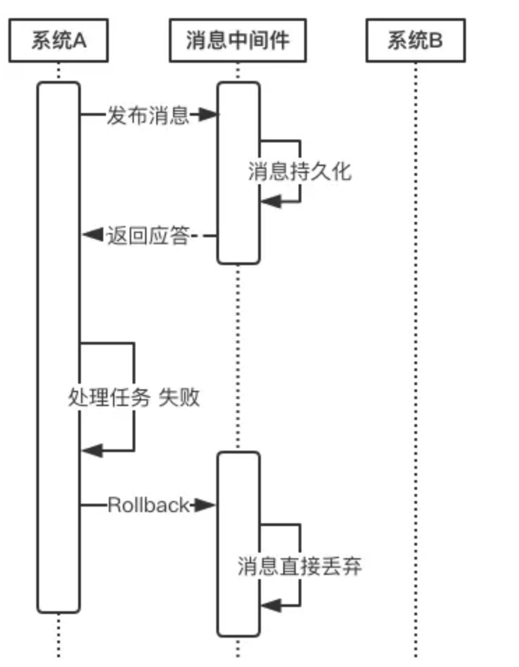
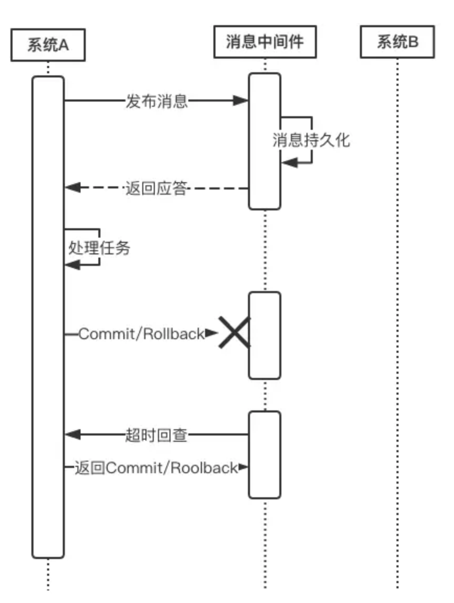
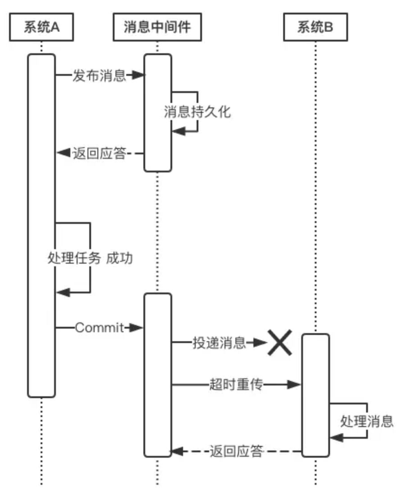
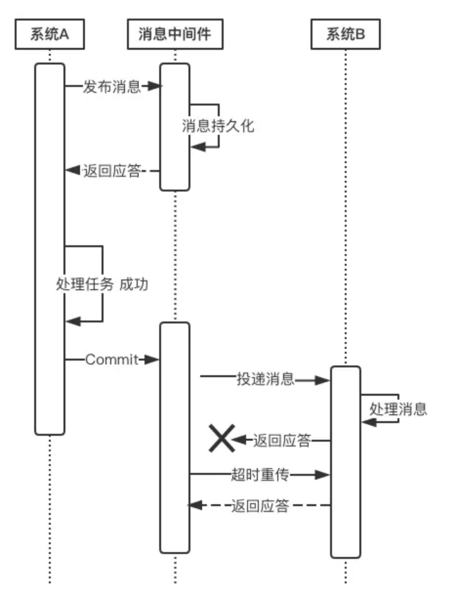
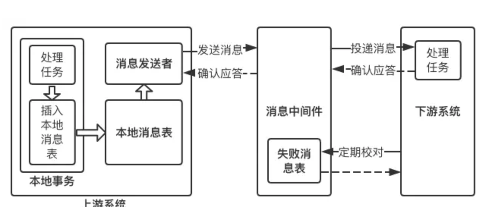

分布式事务的解决方案有如下几种：

* 全局消息
* 基于可靠消息服务的分布式事务
* TCC
* 最大努力通知

## 方案1：全局事务（DTP模型）
全局事务基于DTP模型实现。DTP是由X/Open组织提出的一种分布式事务模型——X/Open Distributed Transaction Processing Reference Model。它规定了要实现分布式事务，需要三种角色：

* AP：Application 应用系统它就是我们开发的业务系统，在我们开发的过程中，可以使用资源管理器提供的事务接口来实现分布式事务。

* TM：Transaction Manager 事务管理器

    * 分布式事务的实现由事务管理器来完成，它会提供分布式事务的操作接口供我们的业务系统调用。这些接口称为TX接口。
    * 事务管理器还管理着所有的资源管理器，通过它们提供的XA接口来同一调度这些资源管理器，以实现分布式事务。
    * DTP只是一套实现分布式事务的规范，并没有定义具体如何实现分布式事务，TM可以采用2PC、3PC、Paxos等协议实现分布式事务。

* RM：Resource Manager 资源管理器

    * 能够提供数据服务的对象都可以是资源管理器，比如：数据库、消息中间件、缓存等。大部分场景下，数据库即为分布式事务中的资源管理器。
    * 资源管理器能够提供单数据库的事务能力，它们通过XA接口，将本数据库的提交、回滚等能力提供给事务管理器调用，以帮助事务管理器实现分布式的事务管理。
    * XA是DTP模型定义的接口，用于向事务管理器提供该资源管理器(该数据库)的提交、回滚等能力。
    * DTP只是一套实现分布式事务的规范，RM具体的实现是由数据库厂商来完成的。

### 实际方案：基于XA协议的两阶段提交

XA是一个分布式事务协议，由Tuxedo提出。XA中大致分为两部分：事务管理器和本地资源管理器。其中本地资源管理器往往由数据库实现，比如Oracle、DB2这些商业数据库都实现了XA接口，而事务管理器作为全局的调度者，负责各个本地资源的提交和回滚。XA实现分布式事务的原理如下：

总的来说，XA协议比较简单，而且一旦商业数据库实现了XA协议，使用分布式事务的成本也比较低。但是，XA也有致命的缺点，那就是性能不理想，特别是在交易下单链路，往往并发量很高，XA无法满足高并发场景。XA目前在商业数据库支持的比较理想，在mysql数据库中支持的不太理想，mysql的XA实现，没有记录prepare阶段日志，主备切换回导致主库与备库数据不一致。许多nosql也没有支持XA，这让XA的应用场景变得非常狭隘。

## 方案2：基于可靠消息服务的分布式事务（事务消息中间件）

这种实现分布式事务的方式需要通过消息中间件来实现。假设有A和B两个系统，分别可以处理任务A和任务B。此时系统A中存在一个业务流程，需要将任务A和任务B在同一个事务中处理。下面来介绍基于消息中间件来实现这种分布式事务。

* 在系统A处理任务A前，首先向消息中间件发送一条消息
* 消息中间件收到后将该条消息持久化，但并不投递。此时下游系统B仍然不知道该条消息的存在。
* 消息中间件持久化成功后，便向系统A返回一个确认应答；
* 系统A收到确认应答后，则可以开始处理任务A；
* 任务A处理完成后，向消息中间件发送Commit请求。该请求发送完成后，对系统A而言，该事务的处理过程就结束了，此时它可以处理别的任务了。但commit消息可能会在传输途中丢失，从而消息中间件并不会向系统B投递这条消息，从而系统就会出现不一致性。这个问题由消息中间件的事务回查机制完成，下文会介绍。
* 消息中间件收到Commit指令后，便向系统B投递该消息，从而触发任务B的执行；
* 当任务B执行完成后，系统B向消息中间件返回一个确认应答，告诉消息中间件该消息已经成功消费，此时，这个分布式事务完成。
>上述过程可以得出如下几个结论：

* 消息中间件扮演者分布式事务协调者的角色。
* 系统A完成任务A后，到任务B执行完成之间，会存在一定的时间差。在这个时间差内，整个系统处于数据不一致的状态，但这短暂的不一致性是可以接受的，因为经过短暂的时间后，系统又可以保持数据一致性，满足BASE理论。

上述过程中，如果任务A处理失败，那么需要进入回滚流程，如下图所示：

* 若系统A在处理任务A时失败，那么就会向消息中间件发送Rollback请求。和发送Commit请求一样，系统A发完之后便可以认为回滚已经完成，它便可以去做其他的事情。
* 消息中间件收到回滚请求后，直接将该消息丢弃，而不投递给系统B，从而不会触发系统B的任务B。

>此时系统又处于一致性状态，因为任务A和任务B都没有执行。

上面所介绍的Commit和Rollback都属于理想情况，但在实际系统中，Commit和Rollback指令都有可能在传输途中丢失。那么当出现这种情况的时候，消息中间件是如何保证数据一致性呢？——答案就是超时询问机制。

系统A除了实现正常的业务流程外，还需提供一个事务询问的接口，供消息中间件调用。当消息中间件收到一条事务型消息后便开始计时，如果到了超时时间也没收到系统A发来的Commit或Rollback指令的话，就会主动调用系统A提供的事务询问接口询问该系统目前的状态。该接口会返回三种结果：

* 提交若获得的状态是“提交”，则将该消息投递给系统B。
* 回滚若获得的状态是“回滚”，则直接将条消息丢弃。
* 处理中若获得的状态是“处理中”，则继续等待。

>消息中间件的超时询问机制能够防止上游系统因在传输过程中丢失Commit/Rollback指令而导致的系统不一致情况，而且能降低上游系统的阻塞时间，上游系统只要发出Commit/Rollback指令后便可以处理其他任务，无需等待确认应答。而Commit/Rollback指令丢失的情况通过超时询问机制来弥补，这样大大降低上游系统的阻塞时间，提升系统的并发度。

下面来说一说消息投递过程的可靠性保证。当上游系统执行完任务并向消息中间件提交了Commit指令后，便可以处理其他任务了，此时它可以认为事务已经完成，接下来消息中间件**一定会保证消息被下游系统成功消费掉！**那么这是怎么做到的呢？这由消息中间件的投递流程来保证。

消息中间件向下游系统投递完消息后便进入阻塞等待状态，下游系统便立即进行任务的处理，任务处理完成后便向消息中间件返回应答。消息中间件收到确认应答后便认为该事务处理完毕！

如果消息在投递过程中丢失，或消息的确认应答在返回途中丢失，那么消息中间件在等待确认应答超时之后就会重新投递，直到下游消费者返回消费成功响应为止。当然，一般消息中间件可以设置消息重试的次数和时间间隔，比如：当第一次投递失败后，每隔五分钟重试一次，一共重试3次。如果重试3次之后仍然投递失败，那么这条消息就需要人工干预。

>有的同学可能要问：消息投递失败后为什么不回滚消息，而是不断尝试重新投递？

这就涉及到整套分布式事务系统的实现成本问题。我们知道，当系统A将向消息中间件发送Commit指令后，它便去做别的事情了。如果此时消息投递失败，需要回滚的话，就需要让系统A事先提供回滚接口，这无疑增加了额外的开发成本，业务系统的复杂度也将提高。对于一个业务系统的设计目标是，在保证性能的前提下，最大限度地降低系统复杂度，从而能够降低系统的运维成本。

>不知大家是否发现，上游系统A向消息中间件提交Commit/Rollback消息采用的是异步方式，也就是当上游系统提交完消息后便可以去做别的事情，接下来提交、回滚就完全交给消息中间件来完成，并且完全信任消息中间件，认为它一定能正确地完成事务的提交或回滚。然而，消息中间件向下游系统投递消息的过程是同步的。也就是消息中间件将消息投递给下游系统后，它会阻塞等待，等下游系统成功处理完任务返回确认应答后才取消阻塞等待。为什么这两者在设计上是不一致的呢？

首先，上游系统和消息中间件之间采用异步通信是为了提高系统并发度。业务系统直接和用户打交道，用户体验尤为重要，因此这种异步通信方式能够极大程度地降低用户等待时间。此外，异步通信相对于同步通信而言，没有了长时间的阻塞等待，因此系统的并发性也大大增加。但异步通信可能会引起Commit/Rollback指令丢失的问题，这就由消息中间件的超时询问机制来弥补。

那么，消息中间件和下游系统之间为什么要采用同步通信呢？

异步能提升系统性能，但随之会增加系统复杂度；而同步虽然降低系统并发度，但实现成本较低。因此，在对并发度要求不是很高的情况下，或者服务器资源较为充裕的情况下，我们可以选择同步来降低系统的复杂度。我们知道，消息中间件是一个独立于业务系统的第三方中间件，它不和任何业务系统产生直接的耦合，它也不和用户产生直接的关联，它一般部署在独立的服务器集群上，具有良好的可扩展性，所以不必太过于担心它的性能，如果处理速度无法满足我们的要求，可以增加机器来解决。而且，即使消息中间件处理速度有一定的延迟那也是可以接受的，因为前面所介绍的BASE理论就告诉我们了，我们追求的是最终一致性，而非实时一致性，因此消息中间件产生的时延导致事务短暂的不一致是可以接受的。

## 方案3：最大努力通知（定期校对）也叫本地消息表

最大努力通知也被称为定期校对，其实在方案二中已经包含，这里再单独介绍，主要是为了知识体系的完整性。这种方案也需要消息中间件的参与，其过程如下：

* 上游系统在完成任务后，向消息中间件同步地发送一条消息，确保消息中间件成功持久化这条消息，然后上游系统可以去做别的事情了；
* 消息中间件收到消息后负责将该消息同步投递给相应的下游系统，并触发下游系统的任务执行；
* 当下游系统处理成功后，向消息中间件反馈确认应答，消息中间件便可以将该条消息删除，从而该事务完成。

上面是一个理想化的过程，但在实际场景中，往往会出现如下几种意外情况：

* 消息中间件向下游系统投递消息失败
* 上游系统向消息中间件发送消息失败

对于第一种情况，消息中间件具有重试机制，我们可以在消息中间件中设置消息的重试次数和重试时间间隔，对于网络不稳定导致的消息投递失败的情况，往往重试几次后消息便可以成功投递，如果超过了重试的上限仍然投递失败，那么消息中间件不再投递该消息，而是记录在失败消息表中，消息中间件需要提供失败消息的查询接口，下游系统会定期查询失败消息，并将其消费，这就是所谓的“定期校对”。

如果重复投递和定期校对都不能解决问题，往往是因为下游系统出现了严重的错误，此时就需要人工干预。

对于第二种情况，需要在上游系统中建立消息重发机制。可以在上游系统建立一张本地消息表，并将 任务处理过程 和 向本地消息表中插入消息 这两个步骤放在一个本地事务中完成。如果向本地消息表插入消息失败，那么就会触发回滚，之前的任务处理结果就会被取消。如果这量步都执行成功，那么该本地事务就完成了。接下来会有一个专门的消息发送者不断地发送本地消息表中的消息，如果发送失败它会返回重试。当然，也要给消息发送者设置重试的上限，一般而言，达到重试上限仍然发送失败，那就意味着消息中间件出现严重的问题，此时也只有人工干预才能解决问题。

对于不支持事务型消息的消息中间件，如果要实现分布式事务的话，就可以采用这种方式。它能够通过重试机制+定期校对实现分布式事务，但相比于第二种方案，它达到数据一致性的周期较长，而且还需要在上游系统中实现消息重试发布机制，以确保消息成功发布给消息中间件，这无疑增加了业务系统的开发成本，使得业务系统不够纯粹，并且这些额外的业务逻辑无疑会占用业务系统的硬件资源，从而影响性能。

因此，尽量选择支持事务型消息的消息中间件来实现分布式事务，如RocketMQ。

## 方案4：TCC（两阶段型、补偿型）

跨应用的业务操作原子性要求，其实是比较常见的。比如在第三方支付场景中的组合支付，用户在电商网站购物后，要同时使用余额和
红包支付该笔订单，而余额系统和红包系统分别是不同的应用系统，支付系统在调用这两个系统进行支付时，就需要保证余额扣减和红
包使用要么同时成功，要么同时失败。

TCC事务的出现正是为了解决应用拆分带来的跨应用业务操作原子性的问题。当然，由于常规的XA事务(2PC，2 Phase Commit, 两阶段提交)
性能上不尽如人意，也有通过TCC事务来解决数据库拆分的使用场景(如账务拆分)，这个本文后续部分再详述。

故从整个系统架构的角度来看，分布式事务的不同方案是存在层次结构的。

#### TCC的机制

明眼一看就知道，TCC应该是三个英文单词的首字母缩写而来。没错，TCC分别对应Try、Confirm和Cancel三种操作，
这三种操作的业务含义如下：

>Try：预留业务资源
Confirm：确认执行业务操作
Cancel：取消执行业务操作

稍稍对照下关系型数据库事务的三种操作：DML、Commit和Rollback，会发现和TCC有异曲同工之妙。在一个跨应用的业务操作中，
Try操作是先把多个应用中的业务资源预留和锁定住，为后续的确认打下基础，类似的，DML操作要锁定数据库记录行，持有数据库资源；
Confirm操作是在Try操作中涉及的所有应用均成功之后进行确认，使用预留的业务资源，和Commit类似；
而Cancel则是当Try操作中涉及的所有应用没有全部成功，需要将已成功的应用进行取消(即Rollback回滚)。
其中Confirm和Cancel操作是一对反向业务操作。

简而言之，TCC是应用层的2PC(2 Phase Commit, 两阶段提交)，如果你将应用看做资源管理器的话。
详细来说，TCC每项操作需要做的事情如下：

1、Try：尝试执行业务。
完成所有业务检查(一致性)预留必须业务资源(准隔离性)
2、Confirm：确认执行业务。
真正执行业务
不做任何业务检查
只使用Try阶段预留的业务资源
3、Cancel：取消执行业务
释放Try阶段预留的业务资源

一个完整的TCC事务参与方包括三部分：

主业务服务：主业务服务为整个业务活动的发起方，如前面提到的组合支付场景，支付系统即是主业务服务。
从业务服务：从业务服务负责提供TCC业务操作，是整个业务活动的操作方。从业务服务必须实现Try、Confirm和Cancel三个接口，
供主业务服务调用。
由于Confirm和Cancel操作可能被重复调用，故要求Confirm和Cancel两个接口必须是幂等的。前面的组合支付场景中的余额系统和
红包系统即为从业务服务。
业务活动管理器：业务活动管理器管理控制整个业务活动，包括记录维护TCC全局事务的事务状态和每个从业务服务的子事务状态，并在业务活动提交时确认所有的TCC型操作的confirm操作，在业务活动取消时调用所有TCC型操作的cancel操作。
可见整个TCC事务对于主业务服务来说是透明的，其中业务活动管理器和从业务服务各自干了一部分工作。

### TCC的优点和限制

TCC事务的优点如下：
解决了跨应用业务操作的原子性问题，在诸如组合支付、账务拆分场景非常实用。
TCC实际上把数据库层的二阶段提交上提到了应用层来实现，对于数据库来说是一阶段提交，规避了数据库层的2PC性能低下问题。

TCC事务的缺点，主要就一个：
TCC的Try、Confirm和Cancel操作功能需业务提供，开发成本高。
当然，对TCC事务的这个缺点是否是缺点，是一个见仁见智的事情。

### 一个案例理解
TCC说实话，TCC的理论有点让人费解。故接下来将以账务拆分为例，对TCC事务的流程做一个描述，希望对理解TCC有所帮助。
账务拆分的业务场景如下，分别位于三个不同分库的帐户A、B、C，A和B一起向C转帐共80元：分布式事务之说说TCC事务

1、Try：尝试执行业务。
完成所有业务检查(一致性)：检查A、B、C的帐户状态是否正常，帐户A的余额是否不少于30元，帐户B的余额是否不少于50元。
预留必须业务资源(准隔离性)：帐户A的冻结金额增加30元，帐户B的冻结金额增加50元，这样就保证不会出现其他并发进程扣减
了这两个帐户的余额而导致在后续的真正转帐操作过程中，帐户A和B的可用余额不够的情况。

2、Confirm：确认执行业务。
真正执行业务：如果Try阶段帐户A、B、C状态正常，且帐户A、B余额够用，则执行帐户A给账户C转账30元、帐户B给账户C转账50元的
转帐操作。
不做任何业务检查：这时已经不需要做业务检查，Try阶段已经完成了业务检查。
只使用Try阶段预留的业务资源：只需要使用Try阶段帐户A和帐户B冻结的金额即可。

3、Cancel：取消执行业务
释放Try阶段预留的业务资源：如果Try阶段部分成功，比如帐户A的余额够用，且冻结相应金额成功，帐户B的余额不够而冻结失败，则需要对帐户A做Cancel操作，将帐户A被冻结的金额解冻掉。