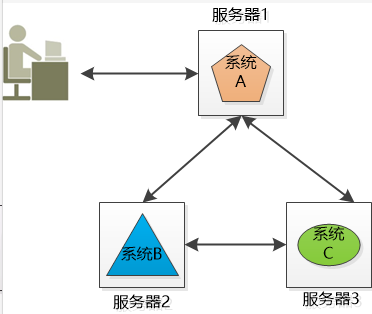
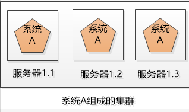
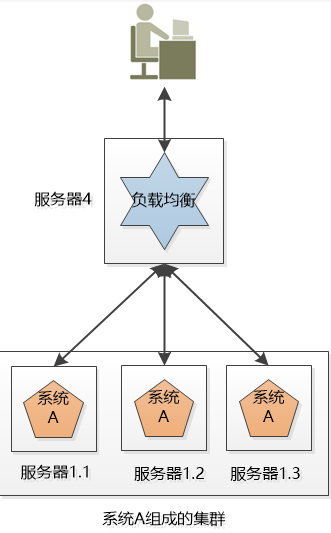
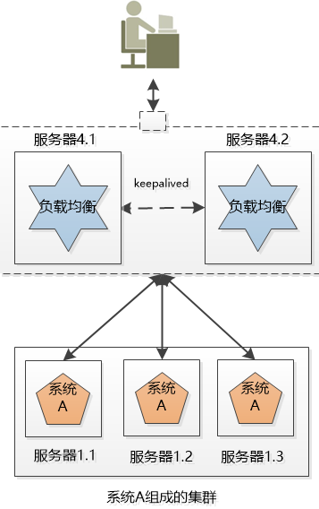
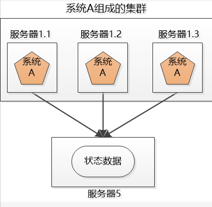
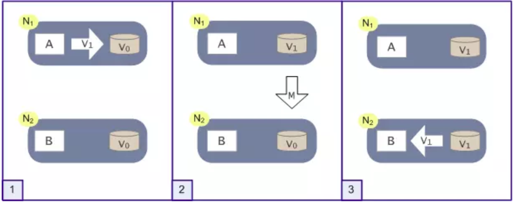
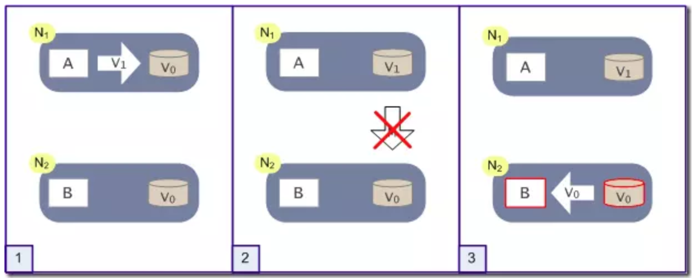

## 分布式
**来自csdn,作者：陆小凤
进阶篇来自：bangerlee
作者对部分地方做了订正
目前这系列文章是网络上分布式系统讲的最全最深入的系列，文中参考了大量国外英文文献。**

小明的公司又3个系统：系统A，系统B和系统C，这三个系统所做的业务不同，被部署在3个独立的机器上运行，他们之间互相调用（当然是跨域网络的），通力合作完成公司的业务流程。

将不同的业务分部在不同的地方，就构成了一个分布式的系统，现在问题来了，系统A是整个分布式系统的脸面，用户直接访问，用户访问量大的时候要么是速度巨慢，要么直接挂掉，怎么办？

由于系统A只有一份，所以会引起单点失败。。。

## 集群（Cluster）

小明的公司不差钱，就多买几台机器吧， 小明把系统A一下子部署了好几份（例如下图的3个服务器），每一份都是系统A的一个实例，对外提供同样的服务，这样，就不怕其中一个坏掉了，还有另外两个呢。

这三个服务器的系统就组成了一个集群。

可是对用户来说，一下子出现这么多系统A，每个系统的IP地址都不一样，到底访问哪一个呢？

如果所有人都访问服务器1.1，那服务器1.1会被累死，剩下两个闲死，成了浪费钱的摆设

 

## 负载均衡（Load Balancer）

小明要尽可能的让3个机器上的系统A工作均衡一些，比如有3万个请求，那就让3个服务器各处理1万个（理想情况），这叫负载均衡

很明显，这个负载均衡的工作最好独立出来，放到独立的服务器上（例如nginx）：

后来小明发现，这个负载均衡的服务器虽然工作内容简单，就是拿到请求，分发请求，但是它还是有可能挂掉，单点失败还是会出现。

没办法，只好把负载均衡也搞成一个集群，bug和系统A的集群有两点不同：

1.这个新的集群中虽然有两个机器，但是我们可以用某种办法，让这个机器对外只提供一个IP地址，也就是用户看到的好像只有一个机器。

2.同一时刻，我们只让一个负载均衡的机器工作，另外一个原地待命，如果工作的那个拐到了，待命的那个就顶上去。

4、弹性

如果3个系统A的实例还是满足不了大量请求，例如双十一，可以申请增加服务器，双十一过后，新增的服务器闲置，成了摆设，于是小明决定尝试云计算，在云端可以轻松的创建，删除虚拟的服务器，那样就可以轻松的随着用户的请求动图的增减服务器了。

 

 5、失效转移

上面的系统看起来很美好，但是做了一个不切实际的假设：

所有的服务都是无状态的，换句话说，假设用户的两次请求直接是没有关联的。

但是现实是，大部分服务都是有状态的，例如购物车。

用户访问系统，在服务器上创建了一个购物车，并向其中加了几个商品，然后服务器1.1挂掉了，用户后续访问就找不到服务器1.1了，这时候就要做失效转移，让另外几个服务器去接管，去处理用户的请求。

可是问题来了，在服务器1.2,1.3上有用户的购物车吗？如果没有，用户就会抱怨，我刚创建的购物车哪里去了？

还有更严重的，假设用户登录过得信息保存到了该服务器1.1上登录的，用户登录过的信息保存到了该服务器的session中，现在这个服务器挂了，用的session就不见了，会把用户踢到了登录界面，让用户再次登录！

 

处理不好状态的问题，集群的威力就大打折扣，无法完成真正的失效转移，甚至无法使用。

 

怎么办？

一种办法是把状态信息在集群的各个服务器之间复制，让集群的各个服务器达成一致，谁来干这个事情？只能像Webspher，Weblogic这样的应用服务器了。

 

还有一种办法， 就是把状态信息几种存储在一个地方，让集群服务器的各个服务器都能访问到：

小明听说Redis不错，那就用Redis来保存吧！

## 认识分布式架构
随着计算机系统规模变得越来越大，将所有的业务单元集中部署在一个或若干个大型机上的体系结构，已经越来越不能满足当今计算机系统，尤其是大型互联网系统的快速发展，各种灵活多变的系统架构模型层出不穷。分布式的处理方式越来越受到业界的青睐——计算机系统正在经历一场前所未有的从集中式向分布式架构的变革。

### 集中式与分布式
**集中式系统**

所谓的集中式系统就是指由一台或多台主计算机组成中心节点，数据集中存储于这个中心节点中，并且整个系统的所有业务单元都集中部署在这个中心节点上，系统的所有功能均由其集中处理。

集中式系统的最大的特点就是部署结构非常简单，底层一般采用从IBM、HP等厂商购买到的昂贵的大型主机。因此无需考虑如何对服务进行多节点的部署，也就不用考虑各节点之间的分布式协作问题。但是，由于采用单机部署，很可能带来系统大而复杂、难于维护、发生单点故障（单个点发生故障的时候会波及到整个系统或者网络，从而导致整个系统或者网络的瘫痪）、扩展性差等问题。

**分布式系统**

分布式系统是一个硬件或软件组件分布在不同的网络计算机上，彼此之间仅仅通过消息传递进行通信和协调的系统。简单来说就是一群独立计算机集合共同对外提供服务，但是对于系统的用户来说，就像是一台计算机在提供服务一样。分布式意味着可以采用更多的普通计算机（相对于昂贵的大型机）组成分布式集群对外提供服务。计算机越多，CPU、内存、存储资源等也就越多，能够处理的并发访问量也就越大。

从分布式系统的概念中我们知道，各个主机之间通信和协调主要通过网络进行，所以分布式系统中的计算机在空间上几乎没有任何限制，这些计算机可能被放在不同的机柜上，也可能被部署在不同的机房中，还可能在不同的城市中，对于大型的网站甚至可能分布在不同的国家和地区。但是，无论空间上如何分布，一个标准的分布式系统应该具有以下几个主要特征：

* 分布性

分布式系统中的多台计算机之间在空间位置上可以随意分布，同时，机器的分布情况也会随时变动。

* 对等性

分布式系统中的计算机没有主／从之分，即没有控制整个系统的主机，也没有被控制的从机，组成分布式系统的所有计算机节点都是对等的。副本（Replica）是分布式系统最常见的概念之一，指的是分布式系统对数据和服务提供的一种冗余方式。在常见的分布式系统中，为了对外提供高可用的服务，我们往往会对数据和服务进行副本处理。数据副本是指在不同节点上持久化同一份数据，当某一个节点上存储的数据丢失时，可以从副本上读取该数据，这是解决分布式系统数据丢失问题最为有效的手段。另一类副本是服务副本，指多个节点提供同样的服务，每个节点都有能力接收来自外部的请求并进行相应的处理。

* 并发性

在一个计算机网络中，程序运行过程的并发性操作是非常常见的行为。例如同一个分布式系统中的多个节点，可能会并发地操作一些共享的资源，如何准确并高效地协调分布式并发操作也成为了分布式系统架构与设计中最大的挑战之一。

* 缺乏全局时钟

在分布式系统中，很难定义两个事件究竟谁先谁后，原因就是因为分布式系统缺乏一个全局的时钟序列控制。

* 故障总是会发生

组成分布式系统的所有计算机，都有可能发生任何形式的故障。除非需求指标允许，在系统设计时不能放过任何异常情况。

## 分布式系统面临的问题

* 通信异常

分布式系统需要在各个节点之间进行网络通信，因此网络通信都会伴随着网络不可用的风险或是系统不可用都会导致最终分布式系统无法顺利完成一次网络通信。另外，即使分布式系统各节点之间的网络通信能够正常进行，其延时也会远大于单机操作，会影响消息的收发的过程，因此消息丢失和消息延迟变得非常普遍。

* 网络分区

当网络由于发生异常情况，导致分布式系统中部分节点之间的网络延时不断增大，最终导致组成分布式系统的所有节点中，只有部分节点之间能够进行正常通信，而另一些节点则不能——我们将这个现象称为网络分区，就是俗称的“脑裂”。当网络分区出现时，分布式系统会出现局部小集群，在极端情况下，这些局部小集群会独立完成原本需要整个分布式才能完成的功能，这就对分布式一致性提出类非常大的挑战。

* 三态

分布式系统的每一次请求与响应，存在特有的“三态”概念，即成功、失败与超时。当出现超时现象时，网络通信的发起方是无法确定当前请求是否被成功处理的。

* 节点故障

节点故障则是分布式环境下另一个比较常见的问题，指的是组成分布式系统的服务器节点出现的宕机或“僵死”现象。

## 分布式理论(一) - CAP定理
前言
CAP原则又称CAP定理，指的是在一个分布式系统中，Consistency（一致性）、 Availability（可用性）、Partition tolerance（分区容错性）这三个基本需求，最多只能同时满足其中的2个。

### 初探分布式理论

**1. CAP原则简介**
选项	描述
Consistency（一致性）	指数据在多个副本之间能够保持一致的特性（严格的一致性）
Availability（可用性）	指系统提供的服务必须一直处于可用的状态，每次请求都能获取到非错的响应（不保证获取的数据为最新数据）
Partition tolerance（分区容错性）	分布式系统在遇到任何网络分区故障的时候，仍然能够对外提供满足一致性和可用性的服务，除非整个网络环境都发生了故障
什么是分区？

在分布式系统中，不同的节点分布在不同的子网络中，由于一些特殊的原因，这些子节点之间出现了网络不通的状态，但他们的内部子网络是正常的。从而导致了整个系统的环境被切分成了若干个孤立的区域，这就是分区。

**2. CAP原则论证**
如图所示，是我们证明CAP的基本场景，网络中有两个节点N1和N2，可以简单的理解N1和N2分别是两台计算机，他们之间网络可以连通，N1中有一个应用程序A，和一个数据库V，N2也有一个应用程序B和一个数据库V。现在，A和B是分布式系统的两个部分，V是分布式系统的数据存储的两个子数据库。

* 在满足一致性的时候，N1和N2中的数据是一样的，V0=V0。

* 在满足可用性的时候，用户不管是请求N1或者N2，都会得到立即响应。

* 在满足分区容错性的情况下，N1和N2有任何一方宕机，或者网络不通的时候，都不会影响N1和N2彼此之间的正常运作。

如图所示，这是分布式系统正常运转的流程，用户向N1机器请求数据更新，程序A更新数据库V0为V1。分布式系统将数据进行同步操作M，将V1同步的N2中V0，使得N2中的数据V0也更新为V1，N2中的数据再响应N2的请求。

根据CAP原则定义，系统的一致性、可用性和分区容错性细分如下：

一致性：N1和N2的数据库V之间的数据是否完全一样。
可用性：N1和N2的对外部的请求能否做出正常的响应。
分区容错性：N1和N2之间的网络是否互通。

这是正常运作的场景，也是理想的场景。作为一个分布式系统，它和单机系统的最大区别，就在于网络。现在假设一种极端情况，N1和N2之间的网络断开了，我们要支持这种网络异常。相当于要满足分区容错性，能不能同时满足一致性和可用性呢？还是说要对他们进行取舍？

假设在N1和N2之间网络断开的时候，有用户向N1发送数据更新请求，那N1中的数据V0将被更新为V1。由于网络是断开的，所以分布式系统同步操作M，所以N2中的数据依旧是V0。这个时候，有用户向N2发送数据读取请求，由于数据还没有进行同步，应用程序没办法立即给用户返回最新的数据V1，怎么办呢？

这里有两种选择：

第一：牺牲数据一致性，保证可用性。响应旧的数据V0给用户。
第二：牺牲可用性，保证数据一致性。阻塞等待，直到网络连接恢复，数据更新操作M完成之后，再给用户响应最新的数据V1。
这个过程，证明了要满足分区容错性的分布式系统，只能在一致性和可用性两者中，选择其中一个。

3. CAP原则权衡
通过CAP理论，我们知道无法同时满足一致性、可用性和分区容错性这三个特性，那要舍弃哪个呢？

3.1. CA without P
如果不要求P（不允许分区），则C（强一致性）和A（可用性）是可以保证的。但其实分区不是你想不想的问题，而是始终会存在，因此CA的系统更多的是允许分区后各子系统依然保持CA。

3.2. CP without A
如果不要求A（可用），相当于每个请求都需要在Server之间强一致，而P（分区）会导致同步时间无限延长，如此CP也是可以保证的。很多传统的数据库分布式事务都属于这种模式。

3.3. AP wihtout C
要高可用并允许分区，则需放弃一致性。一旦分区发生，节点之间可能会失去联系，为了高可用，每个节点只能用本地数据提供服务，而这样会导致全局数据的不一致性。现在众多的NoSQL都属于此类。

## 小结
对于多数大型互联网应用的场景，主机众多、部署分散。而且现在的集群规模越来越大，所以节点故障、网络故障是常态。这种应用一般要保证服务可用性达到N个9，即保证P和A，只有舍弃C（退而求其次保证最终一致性）。虽然某些地方会影响客户体验，但没达到造成用户流程的严重程度。

对于涉及到钱财这样不能有一丝让步的场景，C必须保证。网络发生故障宁可停止服务，这是保证CA，舍弃P。貌似这几年国内银行业发生了不下10起事故，但影响面不大，报到也不多，广大群众知道的少。还有一种是保证CP，舍弃A，例如网络故障时只读不写。

孰优孰劣，没有定论，只能根据场景定夺，适合的才是最好的。

## 分布式理论(二) - BASE理论

### 前言
BASE理论是由eBay架构师提出的。BASE是对CAP中一致性和可用性权衡的结果，其来源于对大规模互联网分布式系统实践的总结，是基于CAP定律逐步演化而来。其核心思想是即使无法做到强一致性，但每个应用都可以根据自身业务特点，才用适当的方式来使系统打到最终一致性。

#### 1. CAP的3选2伪命题
实际上，不是为了P（分区容错性），必须在C（一致性）和A（可用性）之间任选其一。分区的情况很少出现，CAP在大多时间能够同时满足C和A。

对于分区存在或者探知其影响的情况下，需要提供一种预备策略做出处理：

探知分区的发生；
进入显示的分区模式，限制某些操作；
启动恢复过程，恢复数据一致性，补偿分区发生期间的错误。
#### 2. BASE理论简介
BASE理论是Basically Available(基本可用)，Soft State（软状态）和Eventually Consistent（最终一致性）三个短语的缩写。

其核心思想是：

既是无法做到强一致性（Strong consistency），但每个应用都可以根据自身的业务特点，采用适当的方式来使系统达到最终一致性（Eventual consistency）。

#### 3. BASE理论的内容
基本可用（Basically Available）
软状态（Soft State）
最终一致性（Eventually Consistent）
下面展开讨论：

3.1. 基本可用
什么是基本可用呢？假设系统，出现了不可预知的故障，但还是能用，相比较正常的系统而言：

响应时间上的损失：正常情况下的搜索引擎0.5秒即返回给用户结果，而基本可用的搜索引擎可以在2秒作用返回结果。

功能上的损失：在一个电商网站上，正常情况下，用户可以顺利完成每一笔订单。但是到了大促期间，为了保护购物系统的稳定性，部分消费者可能会被引导到一个降级页面。

3.2. 软状态
什么是软状态呢？相对于原子性而言，要求多个节点的数据副本都是一致的，这是一种“硬状态”。

软状态指的是：允许系统中的数据存在中间状态，并认为该状态不影响系统的整体可用性，即允许系统在多个不同节点的数据副本存在数据延时。

3.3. 最终一致性
上面说软状态，然后不可能一直是软状态，必须有个时间期限。在期限过后，应当保证所有副本保持数据一致性，从而达到数据的最终一致性。这个时间期限取决于网络延时、系统负载、数据复制方案设计等等因素。

而在实际工程实践中，最终一致性分为5种：

3.3.1. 因果一致性（Causal consistency）

因果一致性指的是：如果节点A在更新完某个数据后通知了节点B，那么节点B之后对该数据的访问和修改都是基于A更新后的值。于此同时，和节点A无因果关系的节点C的数据访问则没有这样的限制。

3.3.2. 读己之所写（Read your writes）

读己之所写指的是：节点A更新一个数据后，它自身总是能访问到自身更新过的最新值，而不会看到旧值。其实也算一种因果一致性。

3.3.3. 会话一致性（Session consistency）

会话一致性将对系统数据的访问过程框定在了一个会话当中：系统能保证在同一个有效的会话中实现 “读己之所写” 的一致性，也就是说，执行更新操作之后，客户端能够在同一个会话中始终读取到该数据项的最新值。

3.3.4. 单调读一致性（Monotonic read consistency）

单调读一致性指的是：如果一个节点从系统中读取出一个数据项的某个值后，那么系统对于该节点后续的任何数据访问都不应该返回更旧的值。

3.3.5. 单调写一致性（Monotonic write consistency）

单调写一致性指的是：一个系统要能够保证来自同一个节点的写操作被顺序的执行。

在实际的实践中，这5种系统往往会结合使用，以构建一个具有最终一致性的分布式系统。

实际上，不只是分布式系统使用最终一致性，关系型数据库在某个功能上，也是使用最终一致性的。比如备份，数据库的复制过程是需要时间的，这个复制过程中，业务读取到的值就是旧的。当然，最终还是达成了数据一致性。这也算是一个最终一致性的经典案例。

### 更具体的分布式问题
#### 一、分布式事务
指事务的操作位于不同的节点上，需要保证事务的 AICD 特性。例如在下单场景下，库存和订单如果不在同一个节点上，就需要涉及分布式事务。

本地消息
1. 原理
本地消息表与业务数据表处于同一个数据库中，这样就能利用本地事务来保证在对这两个表的操作满足事务特性。

在分布式事务操作的一方，它完成写业务数据的操作之后向本地消息表发送一个消息，本地事务能保证这个消息一定会被写入本地消息表中。
之后将本地消息表中的消息转发到 Kafka 等消息队列（MQ）中，如果转发成功则将消息从本地消息表中删除，否则继续重新转发。
在分布式事务操作的另一方从消息队列中读取一个消息，并执行消息中的操作。

2. 分析
本地消息表利用了本地事务来实现分布式事务，并且使用了消息队列来保证最终一致性。

两阶段提交协议
2PC
参考这里：https://www.cnblogs.com/AndyAo/p/8228099.html

#### 二、分布式锁
可以使用 Java 提供的内置锁来实现进程同步：由 JVM 实现的 synchronized 和 JDK 提供的 Lock。但是在分布式场景下，需要同步的进程可能位于不同的节点上，那么就需要使用分布式锁来同步。

原理
锁可以有阻塞锁和乐观锁两种实现方式，这里主要探讨阻塞锁实现。阻塞锁通常使用互斥量来实现，互斥量为 1 表示有其它进程在使用锁，此时处于锁定状态，互斥量为 0 表示未锁定状态。1 和 0 可以用一个整型值来存储，也可以用某个数据存在或者不存在来存储，某个数据存在表示互斥量为 1，也就是锁定状态。

实现
##### 1. 数据库的唯一索引
当想要获得锁时，就向表中插入一条记录，释放锁时就删除这条记录。唯一索引可以保证该记录只被插入一次，那么就可以用这个记录是否存在来判断是否存于锁定状态。

这种方式存在以下几个问题：

锁没有失效时间，解锁失败会导致死锁，其他线程无法再获得锁。
只能是非阻塞锁，插入失败直接就报错了，无法重试。
不可重入，同一线程在没有释放锁之前无法再获得锁。
##### 2. Redis 的 SETNX 指令
使用 SETNX（set if not exist）指令插入一个键值对，如果 Key 已经存在，那么会返回 False，否则插入成功并返回 True。

SETNX 指令和数据库的唯一索引类似，可以保证只存在一个 Key 的键值对，可以用一个 Key 的键值对是否存在来判断是否存于锁定状态。

EXPIRE 指令可以为一个键值对设置一个过期时间，从而避免了死锁的发生。

##### 3. Redis 的 RedLock 算法
使用了多个 Redis 实例来实现分布式锁，这是为了保证在发生单点故障时仍然可用。

尝试从 N 个相互独立 Redis 实例获取锁，如果一个实例不可用，应该尽快尝试下一个。
计算获取锁消耗的时间，只有当这个时间小于锁的过期时间，并且从大多数（N/2+1）实例上获取了锁，那么就认为锁获取成功了。
如果锁获取失败，会到每个实例上释放锁。
##### 4. Zookeeper 的有序节点
Zookeeper 是一个为分布式应用提供一致性服务的软件，例如配置管理、分布式协同以及命名的中心化等，这些都是分布式系统中非常底层而且是必不可少的基本功能，但是如果自己实现这些功能而且要达到高吞吐、低延迟同时还要保持一致性和可用性，实际上非常困难。

（一）抽象模型

Zookeeper 提供了一种树形结构级的命名空间，/app1/p_1 节点表示它的父节点为 /app1。

（二）节点类型

永久节点：不会因为会话结束或者超时而消失；
临时节点：如果会话结束或者超时就会消失；
有序节点：会在节点名的后面加一个数字后缀，并且是有序的，例如生成的有序节点为 /lock/node-0000000000，它的下一个有序节点则为 /lock/node-0000000001，依次类推。
（三）监听器

为一个节点注册监听器，在节点状态发生改变时，会给客户端发送消息。

（四）分布式锁实现

创建一个锁目录 /lock；
在 /lock 下创建临时的且有序的子节点，第一个客户端对应的子节点为 /lock/lock-0000000000，第二个为 /lock/lock-0000000001，以此类推；
客户端获取 /lock 下的子节点列表，判断自己创建的子节点是否为当前子节点列表中序号最小的子节点，如果是则认为获得锁；否则监听自己的前一个子节点，获得子节点的变更通知后重复此步骤直至获得锁；
执行业务代码，完成后，删除对应的子节点。
（五）会话超时

如果一个已经获得锁的会话超时了，因为创建的是临时节点，所以该会话对应的临时节点会被删除，其它会话就可以获得锁了。可以看到，Zookeeper 分布式锁不会出现数据库的唯一索引实现分布式锁的死锁问题。

（六）羊群效应

一个节点未获得锁，需要监听自己的前一个子节点，这是因为如果监听所有的子节点，那么任意一个子节点状态改变，其它所有子节点都会收到通知（羊群效应），而我们只希望它的后一个子节点收到通知。

## 三、分布式 Session
在分布式场景下，一个用户的 Session 如果只存储在一个服务器上，那么当负载均衡器把用户的下一个请求转发到另一个服务器上，该服务器没有用户的 Session，就可能导致用户需要重新进行登录等操作。

1. Sticky Sessions
需要配置负载均衡器，使得一个用户的所有请求都路由到一个服务器节点上，这样就可以把用户的 Session 存放在该服务器节点中。

缺点：当服务器节点宕机时，将丢失该服务器节点上的所有 Session。

2. Session Replication
在服务器节点之间进行 Session 同步操作，这样的话用户可以访问任何一个服务器节点。

缺点：需要更好的服务器硬件条件；需要对服务器进行配置。

3. Persistent DataStore
将 Session 信息持久化到一个数据库中。

缺点：有可能需要去实现存取 Session 的代码。

4. In-Memory DataStore
可以使用 Redis 和 Memcached 这种内存型数据库对 Session 进行存储，可以大大提高 Session 的读写效率。内存型数据库同样可以持久化数据到磁盘中来保证数据的安全性。

## 四、负载均衡
算法
1. 轮询（Round Robin）
轮询算法把每个请求轮流发送到每个服务器上。下图中，一共有 6 个客户端产生了 6 个请求，这 6 个请求按 (1, 2, 3, 4, 5, 6) 的顺序发送。最后，(1, 3, 5) 的请求会被发送到服务器 1，(2, 4, 6) 的请求会被发送到服务器 2。

该算法比较适合每个服务器的性能差不多的场景，如果有性能存在差异的情况下，那么性能较差的服务器可能无法承担过大的负载（下图的 Server 2）。

2. 加权轮询（Weighted Round Robbin）
加权轮询是在轮询的基础上，根据服务器的性能差异，为服务器赋予一定的权值。例如下图中，服务器 1 被赋予的权值为 5，服务器 2 被赋予的权值为 1，那么 (1, 2, 3, 4, 5) 请求会被发送到服务器 1，(6) 请求会被发送到服务器 2。

3. 最少连接（least Connections）
由于每个请求的连接时间不一样，使用轮询或者加权轮询算法的话，可能会让一台服务器当前连接数过大，而另一台服务器的连接过小，造成负载不均衡。例如下图中，(1, 3, 5) 请求会被发送到服务器 1，但是 (1, 3) 很快就断开连接，此时只有 (5) 请求连接服务器 1；(2, 4, 6) 请求被发送到服务器 2，只有 (2) 的连接断开。该系统继续运行时，服务器 2 会承担过大的负载。

最少连接算法就是将请求发送给当前最少连接数的服务器上。例如下图中，服务器 1 当前连接数最小，那么新到来的请求 6 就会被发送到服务器 1 上。

4. 加权最少连接（Weighted Least Connection）
在最少连接的基础上，根据服务器的性能为每台服务器分配权重，再根据权重计算出每台服务器能处理的连接数。

5. 随机算法（Random）
把请求随机发送到服务器上。和轮询算法类似，该算法比较适合服务器性能差不多的场景。

6. 源地址哈希法 (IP Hash)
源地址哈希通过对客户端 IP 哈希计算得到的一个数值，用该数值对服务器数量进行取模运算，取模结果便是目标服务器的序号。

优点：保证同一 IP 的客户端都会被 hash 到同一台服务器上。
缺点：不利于集群扩展，后台服务器数量变更都会影响 hash 结果。可以采用一致性 Hash 改进。

### 实现
1. HTTP 重定向
HTTP 重定向负载均衡服务器收到 HTTP 请求之后会返回服务器的地址，并将该地址写入 HTTP 重定向响应中返回给浏览器，浏览器收到后需要再次发送请求。

缺点：

用户访问的延迟会增加；
如果负载均衡器宕机，就无法访问该站点。

 

2. DNS 重定向
使用 DNS 作为负载均衡器，根据负载情况返回不同服务器的 IP 地址。大型网站基本使用了这种方式做为第一级负载均衡手段，然后在内部使用其它方式做第二级负载均衡。

缺点：

DNS 查找表可能会被客户端缓存起来，那么之后的所有请求都会被重定向到同一个服务器。

 

3. 修改 MAC 地址
使用 LVS（Linux Virtual Server）这种链路层负载均衡器，根据负载情况修改请求的 MAC 地址。

 

4. 修改 IP 地址
在网络层修改请求的目的 IP 地址。

 

5. 代理自动配置
正向代理与反向代理的区别：

正向代理：发生在客户端，是由用户主动发起的。比如翻墙，客户端通过主动访问代理服务器，让代理服务器获得需要的外网数据，然后转发回客户端。
反向代理：发生在服务器端，用户不知道代理的存在。
PAC 服务器是用来判断一个请求是否要经过代理。

 

### 高可用之“脑裂”
在涉及到高可用性时，经常会听到”脑裂“，到底啥是”脑裂“？

一句话：当两（多）个节点同时认为自已是唯一处于活动状态的服务器从而出现争用资源的情况，这种争用资源的场景即是所谓的“脑裂”（split-brain）或”区间集群“（partitioned cluster）。

HeartBeat原理：

HeartBeat运行于备用主机上的Heartbeat可以通过以太网连接检测主服务器的运行状态，一旦其无法检测到主服务器的"心跳"则自动接管主服务器的资源。通常情况下，主、备服务器间的心跳连接是一个独立的物理连接，这个连接可以是串行线缆、一个由"交叉线"实现的以太网连接。Heartbeat甚至可同时通过多个物理连接检测主服务器的工作状态，而其只要能通过其中一个连接收到主服务器处于活动状态的信息，就会认为主服务器处于正常状态。从实践经验的角度来说，建议为Heartbeat配置多条独立的物理连接，以避免Heartbeat通信线路本身存在单点故障。

在“双机热备”高可用（HA）系统中，当联系2个节点的“心跳线”断开时，本来为一整体、动作协调的HA系统，就分裂成为2个独立的个体。由于相互失去了联系，都以为是对方出了故障，2个节点上的HA软件像“裂脑人”一样，“本能”地争抢“共享资源”、争起“应用服务”，就会发生严重后果：或者共享资源被瓜分、2边“服务”都起不来了；或者2边“服务”都起来了，但同时读写“共享存储”，导致数据损坏（常见如数据库轮询着的联机日志出错）。
运行于备用主机上的Heartbeat可以通过以太网连接检测主服务器的运行状态，一旦其无法检测到主服务器的“心跳”则自动接管主服务器的资源。通常情况下，主、备服务器间的心跳连接是一个独立的物理连接，这个连接可以是串行线缆、一个由“交叉线”实现的以太网连接。Heartbeat甚至可同时通过多个物理连接检测主服务器的工作状态，而其只要能通过其中一个连接收到主服务器处于活动状态的信息，就会认为主服务器处于正常状态。从实践经验的角度来说，建议为Heartbeat配置多条独立的物理连接，以避免Heartbeat通信线路本身存在单点故障。
1、串行电缆：被认为是比以太网连接安全性稍好些的连接方式，因为hacker无法通过串行连接运行诸如telnet、ssh或rsh类的程序，从而可以降低其通过已劫持的服务器再次侵入备份服务器的几率。但串行线缆受限于可用长度，因此主、备服务器的距离必须非常短。
2、以太网连接：使用此方式可以消除串行线缆的在长度方面限制，并且可以通过此连接在主备服务器间同步文件系统，从而减少了从正常通信连接带宽的占用。
  基于冗余的角度考虑，应该在主、备服务器使用两个物理连接传输heartbeat的控制信息；这样可以避免在一个网络或线缆故障时导致两个节点同时认为自已是唯一处于活动状态的服务器从而出现争用资源的情况，这种争用资源的场景即是所谓的“脑裂”（split-brain）或“partitioned cluster”。在两个节点共享同一个物理设备资源的情况下，脑裂会产生相当可怕的后果。
  为了避免出现脑裂，可采用下面的预防措施：
添加冗余的心跳线，例如双线条线。尽量减少“裂脑”发生机会。
启用磁盘锁。正在服务一方锁住共享磁盘，“裂脑”发生时，让对方完全“抢不走”共享磁盘资源。但使用锁磁盘也会有一个不小的问题，如果占用共享盘的一方不主动“解锁”，另一方就永远得不到共享磁盘。现实中假如服务节点突然死机或崩溃，就不可能执行解锁命令。后备节点也就接管不了共享资源和应用服务。于是有人在HA中设计了“智能”锁。即，正在服务的一方只在发现心跳线全部断开（察觉不到对端）时才启用磁盘锁。平时就不上锁了。
设置仲裁机制。例如设置参考IP（如网关IP），当心跳线完全断开时，2个节点都各自ping一下 参考IP，不通则表明断点就出在本端，不仅“心跳”、还兼对外“服务”的本端网络链路断了，即使启动（或继续）应用服务也没有用了，那就主动放弃竞争，让能够ping通参考IP的一端去起服务。更保险一些，ping不通参考IP的一方干脆就自我重启，以彻底释放有可能还占用着的那些共享资源。